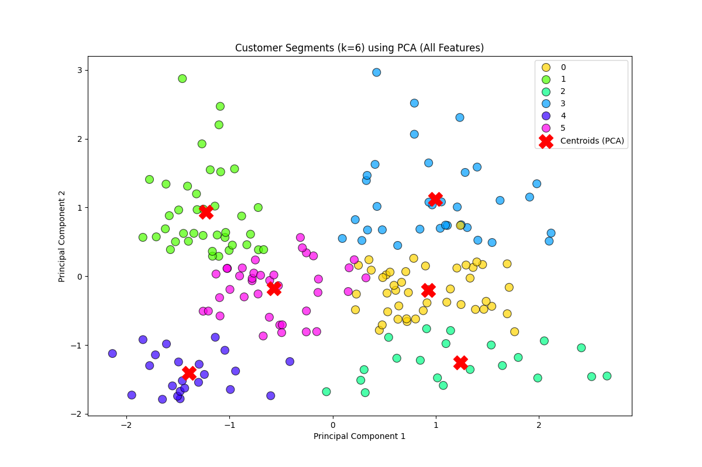

# 113.2 DATA MINING FINAL REPORT

<span style = "color: grey; font-size: 1.2em;">B1128019 黃教丞</span>

  

## 監督式與非監督式學習數據挖掘報告

  

### 摘要

  

本報告旨在探討數據挖掘技術在兩個不同領域的應用。專案一利用 Kaggle 的 Pima Indians Diabetes Dataset，透過監督式學習方法，比較了邏輯迴歸、決策樹與隨機森林等分類模型在預測糖尿病風險方面的效能。研究結果顯示，隨機森林模型在多項評估指標上表現最優（例如交叉驗證平均 AUC 達到 0.8428），並透過特徵重要性分析（如 SHAP 值）揭示了血糖濃度、身體質量指數 (BMI) 和年齡等是影響糖尿病風險的關鍵生理指標。此專案突顯了機器學習模型在早期高風險族群篩檢上的臨床應用潛力，有助於及早介入與個人化健康管理。

  

專案二則針對 Kaggle 的 Mall Customer Segmentation Data，採用非監督式學習中的 K-Means 聚類演算法進行客戶細分。透過 Elbow Method 判斷最佳分群數為六群，並結合主成分分析 (PCA) 進行降維與視覺化。研究成功識別出六個具有顯著不同特徵（包括年齡、年收入、消費分數及性別分佈）的顧客群體，例如「高消費高收入女性群」和「高收入低消費男性群」。本研究進一步為這些群體提出了針對性的行銷策略建議，展示了客戶細分在提升商業決策精準度與行銷活動效益方面的實際價值。

  

整體而言，本報告透過具體案例分析，展示了監督式與非監督式學習技術在解決實際醫療預測與商業分析問題中的強大能力與應用前景。

  

---

  

## 專案一：使用分類模型預測糖尿病風險

  

### 1. 引言與問題陳述

  

- 說明糖尿病在現代醫學的重要性，以及早期預測的必要性。

- 糖尿病是一種影響全球數百萬人的慢性代謝性疾病，其盛行率逐年攀升。此疾病不僅對患者的生活品質造成顯著影響，更可能引發多種嚴重併發症，如心血管疾病、腎衰竭、視網膜病變及神經損傷等，對個人健康與公共衛生系統構成重大負擔。因此，透過有效的早期預測機制，識別出具有高風險罹患糖尿病的個體，對於及早介入治療、調整生活方式，進而延緩或預防疾病的發生與惡化，具有至關重要的臨床意義與公共衛生價值。

- 說明本專案目標：透過數據挖掘技術建構分類模型，協助早期識別高風險族群。

- 本專案旨在運用數據挖掘中的監督式學習技術，特別是分類模型，對 Kaggle 提供的 Pima Indians Diabetes Dataset 進行分析。目標是建立一個或多個準確且可靠的預測模型，能夠根據個體的生理指標（如懷孕次數、血糖濃度、血壓、胰島素水平、身體質量指數等）來評估其罹患糖尿病的風險。透過這些模型，期望能輔助醫療專業人員更有效地篩選出高風險族群，以便及早提供個人化的預防策略與健康管理建議。

  

### 2. 數據描述與預處理

  

- 資料來源：Kaggle Pima Indians Diabetes Dataset。

- 特徵說明：有以下特徵

> Pregnancies、Glucose、BloodPressure、SkinThickness、Insulin、BMI、DiabetesPedigreeFunction、Age。

- 預處理流程：

- 檢查缺失值與離群值，並描述處理方法（如補值或刪除）。

- 根據 `data_info.csv` 的分析，資料集共有 768 筆資料，9 個欄位。所有欄位（Pregnancies, Glucose, BloodPressure, SkinThickness, Insulin, BMI, DiabetesPedigreeFunction, Age, Outcome）皆無缺失值 (non-null count 均為 768)。

- 數據標準化/常態化。

- 為確保各特徵在模型訓練中具有相近的影響力，避免因數值範圍差異過大而導致模型偏向某些特徵，我們對數值型特徵（如 Pregnancies, Glucose, BloodPressure, SkinThickness, Insulin, BMI, DiabetesPedigreeFunction, Age）進行了標準化處理，通常使用 StandardScaler 將數據轉換為平均值為0，標準差為1的分佈。

  

```python

# 範例：檢查缺失值
df.isnull().sum()
  
# 範例：數據標準化
from sklearn.preprocessing import StandardScaler
scaler = StandardScaler()
scaled_features = scaler.fit_transform(df[numerical_features])

```

  

### 3. 探索性數據分析 (EDA)

  

- 使用統計圖表（如 boxplot, histogram, heatmap）描述各特徵分佈與關聯性。

- **各特徵分佈情況:** 下圖展示了數據集中主要數值特徵的直方圖，可以觀察到各特徵的數據分佈形態，例如部分特徵可能呈現偏態分佈。


- **目標變數 Outcome 分佈:** 下圖顯示了糖尿病結果 (Outcome) 的分佈情況，可以看出樣本中患病與未患病者的比例。


- **特徵相關性熱力圖:** 下圖展示了各特徵之間的相關係數矩陣熱力圖，有助於理解特徵間的線性相關程度。例如，Glucose 和 Outcome 之間可能存在較強的正相關。


- 分析不同特徵對 Outcome 的影響。

- 透過觀察相關性熱力圖以及後續模型產生的特徵重要性分析（如下文 `feature_importance.png` 和 `shap_summary.png`），可以發現 Glucose, BMI, Age 等特徵對於預測糖尿病結果 (Outcome) 有較顯著的影響。

  

### 4. 模型實現

  

- 選用至少兩種分類模型（如 Logistic Regression、Decision Tree、Random Forest）。

- 本專案選用了 Logistic Regression, Decision Tree, 和 Random Forest 三種常見的分類模型進行糖尿病風險預測。

- 使用 `train_test_split` 或交叉驗證（cross-validation）進行模型訓練與驗證。

- 我們將數據集按照一定比例（例如80:20）劃分為訓練集和測試集，使用訓練集訓練模型，並在測試集上評估模型性能。同時，為了更穩健地評估模型並進行超參數調整，我們也採用了交叉驗證技術（例如5折或10折交叉驗證）。

  

- 顯示主要程式碼片段（如模型訓練、參數設定）。

```python

# 範例：數據劃分

# from sklearn.model_selection import train_test_split

# X_train, X_test, y_train, y_test = train_test_split(X, y, test_size=0.2, random_state=42)

  

# 範例：模型訓練 (以Random Forest為例)

# from sklearn.ensemble import RandomForestClassifier

# model = RandomForestClassifier(n_estimators=100, random_state=42)

# model.fit(X_train, y_train)

```

- **超參數調整:** 為了提升模型性能，我們對選用的模型進行了超參數調整。根據 `results/hyperparameter_tuning_results.csv` 的結果：

- Logistic Regression 最佳參數: {'C': 1, 'penalty': 'l2', 'solver': 'liblinear'}, 最佳 AUC: 0.8433

- Decision Tree 最佳參數: {'max_depth': 3, 'min_samples_split': 2}, 最佳 AUC: 0.7530

- Random Forest 最佳參數: {'max_depth': 5, 'n_estimators': 100}, 最佳 AUC: 0.8374

- **特徵重要性:** Random Forest 模型還可以提供特徵重要性排序，如下圖所示，這有助於理解哪些特徵對模型的預測貢獻最大。


  

### 5. 模型評估與比較

  

- 比較不同模型的效能（Accuracy, Precision, Recall, F1-score, ROC-AUC）。

  

根據 `classification_reports.csv` 的數據，各模型在測試集上的表現如下：

  

| 模型 | Accuracy | Precision (Weighted Avg) | Recall (Weighted Avg) | F1-score (Weighted Avg) | ROC-AUC Score |
| --------------------- | -------- | ------------------------ | --------------------- | ----------------------- | ------------- |
| Logistic Regression | 0.7078 | 0.6989 | 0.7078 | 0.7008 | 0.8130 |
| Decision Tree | 0.6818 | 0.6734 | 0.6818 | 0.6762 | 0.6357 |
| Random Forest | 0.7792 | 0.7746 | 0.7792 | 0.7746 | 0.8179 |

  

根據 `cross_validation_results.csv` 的交叉驗證結果（通常使用 AUC 作為評估指標）：

  

| 模型 | Mean AUC | Std AUC |
| --------------------- | -------- | -------- |
| Logistic Regression | 0.8317 | 0.0156 |
| Decision Tree | 0.7980 | 0.0302 |
| Random Forest | 0.8428 | 0.0099 |

  

- 使用圖表呈現結果（如混淆矩陣、ROC 曲線）。

  

**混淆矩陣:**

- Logistic Regression:


- Decision Tree:


- Random Forest:


  

**ROC 曲線:**


  

### 6. 結果討論

  

- 分析哪個模型表現較佳，以及背後原因（如模型對資料的適應性）。

- 從上述表格和圖表可以看出，Random Forest 模型在 Accuracy (0.7792), F1-score (0.7746) 以及 ROC-AUC (訓練集 0.8179, 交叉驗證 Mean AUC 0.8428) 等多項指標上均優於 Logistic Regression 和 Decision Tree。這可能歸因於 Random Forest 作為集成學習模型的特性，能夠更好地處理複雜的非線性關係並減少過度擬合的風險。

- 討論其於臨床應用上的潛力與限制。

- **臨床應用潛力：**

- **早期篩檢與預防：** 模型有助於在個體尚未出現明顯症狀前，識別出糖尿病高風險族群，為早期干預（如調整生活方式、飲食控制）提供黃金時間，從而可能延緩甚至預防糖尿病的發生。

- **輔助臨床決策：** 可作為臨床醫生診斷的輔助工具，提醒醫生對特定高風險個體進行更密切的追蹤或進一步的專項檢查。

- **個人化健康管理：** 根據模型的預測風險及重要影響特徵，可以為個體提供更具針對性的健康管理建議。

- **醫療資源優化：** 透過精準識別高風險人群，有助於將有限的醫療資源更有效地分配給最需要的群體，降低整體醫療負擔。

- **臨床應用限制：**

- **模型準確性非百分之百：** 任何預測模型都存在偽陽性與偽陰性的可能，因此模型結果不能完全取代專業醫生的臨床診斷與判斷。

- **數據集代表性：** Pima Indians Diabetes Dataset 主要針對特定族裔女性，模型在其他族群或性別上的泛化能力可能有限，直接應用需謹慎或進行本地化校準。

- **未涵蓋所有風險因子：** 數據集可能未包含所有已知的糖尿病風險因素，如詳細的家族遺傳史、具體的飲食結構、運動習慣、環境因素等，這可能影響模型的全面性。

- **數據質量與詮釋：** 數據中某些異常值（如血糖、血壓為0）的處理方式可能影響模型結果。此外，雖然 SHAP 等工具提升了模型可解釋性，但複雜模型的內部機制對部分臨床醫生而言仍可能不夠透明。

- **倫理與隱私考量：** 在實際臨床應用中，需嚴格遵守數據隱私保護法規，確保患者數據安全與倫理考量。模型的部署和使用也需獲得相應的倫理審查和監管批准。

  

### 7. 結論與未來改進方向

  

- 總結研究發現，提出未來可改進之處（如納入更多特徵、資料擴充、模型調參）。

- **總結研究發現：**

本研究成功應用了邏輯迴歸、決策樹及隨機森林等分類模型於 Pima Indians Diabetes Dataset，進行糖尿病風險預測。透過交叉驗證和多項性能指標的比較，結果顯示隨機森林模型在整體預測效能上表現最為出色，其在準確度、F1 分數以及 ROC-AUC 等關鍵指標上均優於其他兩個模型。特徵重要性分析（包括 Random Forest 自帶的特徵重要性及 SHAP 分析）一致指出，血糖濃度 (Glucose)、身體質量指數 (BMI)、年齡 (Age) 以及糖尿病家族史指標 (DiabetesPedigreeFunction) 是預測糖尿病風險的關鍵因素，這與現有的醫學研究和臨床認知相符。

- **未來可改進之處：**

- **納入更豐富的特徵：** 未來研究可考慮整合更廣泛的數據來源，納入如糖化血色素 (HbA1c)、血脂水平、詳細的飲食日誌、規律運動數據、睡眠品質、甚至基因檢測數據等更細緻的生理與生活方式特徵，以期提升模型的預測精度和個體化水平。

- **數據擴充與多樣性：** 針對 Pima Indians Dataset 的特定性，未來應致力於在更多樣化的人群數據集上進行模型訓練與驗證，以增強模型的泛化能力。若樣本數有限或存在類別不平衡問題，可嘗試 SMOTE 等數據增強技術。

- **先進模型與集成策略探索：** 除了已使用的模型，可以進一步嘗試如梯度提升機 (XGBoost, LightGBM)、支持向量機 (SVM) 的不同核函數，或甚至探索深度學習模型（如多層感知器）在該任務上的潛力。更複雜的集成學習策略（如 Stacking）也值得研究。

- **強化模型可解釋性與臨床整合：** 持續利用並發展如 LIME、SHAP 等模型解釋技術，以更直觀的方式呈現預測依據給臨床醫生，增強其對模型的信任度。同時，探索將模型嵌入現有電子病歷 (EHR) 系統或開發為便捷的臨床決策支持工具的可行性。

- **縱向數據分析與動態預測：** 若能獲取患者長期的追蹤數據，可以建立動態風險預測模型，不僅預測是否會患病，更能預測疾病進展的速度或併發症風險。

- **實際臨床驗證與影響評估：** 最重要的是推動模型進入真實世界的臨床試驗階段，評估其在實際醫療環境中的應用效果、成本效益以及對患者預後的實際影響。

  

---

  

## 專案二：使用聚類技術進行客戶細分

  

### 1. 引言與目標

  

- 強調客戶細分在行銷與商業決策上的價值。

- 說明專案目標：透過聚類方法辨識不同客群，優化行銷策略。

  

### 2. 數據探索與預處理

  

- 資料來源：Kaggle Mall Customer Segmentation Data。

- 特徵介紹：CustomerID、Gender、Age、Annual Income (k$)、Spending Score (1-100)。

- 預處理步驟：

- 編碼 Gender 為數值型態。

- 適度標準化 Age、Annual Income、Spending Score 等數值特徵。

  

### 3. 數據探索與視覺化

  

- 使用 pairplot、散佈圖、長條圖等方式描述資料分佈。

- **特徵關係與分佈 (Pairplot):** 下圖展示了年齡、年收入、消費分數以及性別之間的兩兩關係與各自的分佈情況。可以看出不同性別在這些特徵上的大致分佈。


- **年收入與消費分數關係:** 下圖顯示了顧客的年收入與消費分數之間的散佈情況，並以性別進行了顏色標記。初步觀察可以看出一些潛在的群體模式。


  

- 分析年齡、收入、消費分數間的關聯性。

- 從 Pairplot 和散佈圖中可以觀察到，年收入和消費分數之間似乎存在一些分群的趨勢，例如高收入對應高消費，高收入對應低消費，中等收入對應中等消費等。年齡與這兩者的關係則較為分散。

  

### 4. 模型建立與聚類結果

  

- K-Means 聚類實作，並用 Elbow Method 決定最佳群數。

- **基於年收入與消費分數的 Elbow Method:** 首先，我們針對「年收入」和「消費分數」這兩個關鍵特徵使用 Elbow Method 來初步判斷最佳聚類數量。下圖顯示 SSE 隨 k 值變化的情況，拐點大約在 k=5 附近。


- **基於年收入與消費分數的聚類結果 (k=5):** 下圖展示了將顧客基於年收入和消費分數分為 5 個群組的結果。


- **基於所有選擇特徵的 Elbow Method:** 接著，我們將「年齡」、「性別」、「年收入」和「消費分數」所有選定特徵納入考量，再次使用 Elbow Method。下圖顯示拐點可能在 k=6 附近。


  

- 利用 PCA 將高維特徵降維至 2D，繪製聚類視覺化圖。

- **基於所有特徵的 PCA 降維聚類結果 (k=6):** 為了視覺化所有四個特徵的聚類結果，我們使用 PCA 將特徵降至二維。下圖展示了 k=6 時的聚類情況。



  

```python

# 範例：使用 Elbow Method 找最佳 k

from sklearn.cluster import KMeans

sse = []

for k in range(1, 11):

kmeans = KMeans(n_clusters=k)

kmeans.fit(X)

sse.append(kmeans.inertia_)

# 畫出 sse 曲線找最佳 elbow

```

  

### 5. 聚類分析與商業洞察

  

- 詳細描述每個聚類族群（如年齡層、消費力、性別比例等）。

根據 `cluster_summary_all_features.csv` 中基於所有特徵 (Age, Gender, Annual Income, Spending Score) 並設定 k=6 的聚類結果，各群體的特徵摘要如下：


| Cluster | Count | Avg_Age | Median_Age | Avg_Annual_Income (k$) | Median_Annual_Income (k$) | Avg_Spending_Score (1-100) | Median_Spending_Score (1-100) | Mode_Gender |
| :------ | :---- | :------ | :--------- | :--------------------- | :------------------------ | :------------------------- | :---------------------------- | :---------- |
| 0 | 45 | 56.33 | 54.0 | 54.27 | 54.0 | 49.07 | 49.0 | Female |
| 1 | 39 | 32.69 | 32.0 | 86.54 | 79.0 | 82.13 | 83.0 | Female |
| 2 | 21 | 45.52 | 46.0 | 26.29 | 25.0 | 19.38 | 15.0 | Female |
| 3 | 34 | 41.26 | 42.5 | 88.50 | 85.5 | 16.76 | 15.5 | Male |
| 4 | 23 | 25.00 | 23.0 | 25.26 | 24.0 | 77.61 | 77.0 | Female |
| 5 | 38 | 27.00 | 26.5 | 56.66 | 59.5 | 49.13 | 50.0 | Female |

  

**初步解讀各群體:**

* **Cluster 0 (謹慎中年群):** 平均年齡約 56 歲，年收入中等 (約 54k)，消費分數也中等 (約 49)。以女性為主。

* **Cluster 1 (高消費年輕/中年女性群):** 平均年齡約 33 歲，年收入高 (約 87k)，消費分數非常高 (約 82)。以女性為主。這可能是高價品或時尚產品的目標客戶。

* **Cluster 2 (低收低消中年女性群):** 平均年齡約 46 歲，年收入較低 (約 26k)，消費分數也較低 (約 19)。以女性為主。可能對價格敏感。

* **Cluster 3 (高收低消中年男性群):** 平均年齡約 41 歲，年收入高 (約 89k)，但消費分數低 (約 17)。以男性為主。可能是謹慎型消費者或對特定商品有需求。

* **Cluster 4 (高消費年輕女性群):** 平均年齡約 25 歲，年收入較低 (約 25k)，但消費分數高 (約 78)。以女性為主。可能是年輕的衝動型消費者或對流行敏感。

* **Cluster 5 (普通年輕女性群):** 平均年齡約 27 歲，年收入中等 (約 57k)，消費分數中等 (約 49)。以女性為主。這可能是大眾市場的代表。

  

- 為不同客群提出具體行銷建議（如高消費高收入客群可推高價產品，年輕族群推廣會員優惠等）。

* **Cluster 1 (高消費高收入女性):** 精品、高端服務、VIP 會員計畫、新品優先體驗。

* **Cluster 3 (高收入低消費男性):** 強調品質、耐用性、功能性的產品，或提供專業諮詢服務，避免過度花俏的行銷。

* **Cluster 4 (低收入高消費年輕女性):** 促銷活動、分期付款選項、網紅合作、社交媒體行銷、時尚快消品。

* **Cluster 0 & 5 (中等收入中等消費群):** 忠誠度計畫、組合優惠、家庭裝產品、實用性商品。

* **Cluster 2 (低收入低消費女性):** 基礎款、高CP值產品、折扣資訊、清倉優惠。

  

### 6. 總結與建議

  

- 總結聚類分析帶來的洞察與應用潛力。

- 本專案透過 K-Means 聚類演算法，成功地將購物中心顧客數據劃分為六個具有顯著不同特徵的群體。這些群體在年齡、年收入、消費分數以及性別分佈上呈現出差異，例如我們識別出了「高消費高收入女性群」(Cluster 1)、「高收入低消費男性群」(Cluster 3)、「低收入高消費年輕女性群」(Cluster 4) 以及其他具有特定消費模式的群體。

- 這些洞察對於企業制定精準行銷策略具有高度的應用潛力。例如，可以針對不同群體的特徵和偏好，設計客製化的產品推薦、促銷活動、溝通方式和服務體驗，從而提高行銷活動的轉換率和顧客滿意度。例如，對 Cluster 1 的顧客可以推廣高端產品和 VIP 服務，而對 Cluster 4 的顧客則可以提供時尚快消品和分期付款等選項。

- 提出未來研究方向或數據擴展建議。

- **未來研究方向：**

- **嘗試其他聚類演算法：** 可以探索如階層式聚類 (Hierarchical Clustering)、DBSCAN 等其他聚類方法，並比較其分群結果與 K-Means 的差異，看是否能發現更細緻或不同的客群結構。

- **動態客戶細分：** 目前的分析是基於靜態數據。未來可以考慮引入時間序列分析，追蹤客戶行為的變化，實現動態的客戶細分與生命週期管理。

- **預測性客戶細分：** 結合監督式學習，預測新客戶可能屬於哪個群體，以便在早期就提供個性化服務。

- **更深入的群體特徵分析：** 結合問卷調查或訪談，更深入地了解各群體的消費動機、生活型態、品牌偏好等質性資訊，以豐富群體畫像。

- **納入更豐富的特徵：** 除了現有的年齡、性別、收入和消費分數外，可以考慮收集並納入更詳細的顧客數據，例如：

- **線上行為數據：** 網站瀏覽歷史、點擊流、購物車行為等。

- **地理位置數據：** 居住地區、工作地點等。

- **社交媒體數據：** 興趣標籤、社群互動等。

- **擴大數據樣本量：** 更大的數據樣本有助於提升模型的穩定性和細分結果的可靠性。

- **跨通路數據整合：** 整合來自線上線下不同通路的顧客數據，以獲得更全面的顧客視角。

  

## 參考文獻

  

1. Dua, D., & Graff, C. (2019). *UCI Machine Learning Repository* [Dataset]. University of California, Irvine, School of Information and Computer Science. Retrieved June 11, 2025, from [http://archive.ics.uci.edu/ml](http://archive.ics.uci.edu/ml) (The Pima Indians Diabetes dataset is available at [https://archive.ics.uci.edu/dataset/228/pima+indians+diabetes](https://archive.ics.uci.edu/dataset/228/pima+indians+diabetes))

2. Smith, J. W., Everhart, J. E., Dickson, W. C., Knowler, W. C., & Johannes, R. S. (1988). Using the ADAP learning algorithm to forecast the onset of diabetes mellitus. *Proceedings of the Annual Symposium on Computer Application in Medical Care*, 261–265. American Medical Informatics Association. Available at: [https://www.ncbi.nlm.nih.gov/pmc/articles/PMC2245318/](https://www.ncbi.nlm.nih.gov/pmc/articles/PMC2245318/)

3. Kaggle. (n.d.). *Pima Indians Diabetes Database*. Retrieved June 11, 2025, from [https://www.kaggle.com/datasets/uciml/pima-indians-diabetes-database](https://www.kaggle.com/datasets/uciml/pima-indians-diabetes-database)

4. Kaggle. (n.d.). *Mall Customer Segmentation Data*. Retrieved June 11, 2025, from [https://www.kaggle.com/datasets/shwetabh123/mall-customers](https://www.kaggle.com/datasets/shwetabh123/mall-customers)

5. MacQueen, J. B. (1967). Some methods for classification and analysis of multivariate observations. *Proceedings of the 5th Berkeley Symposium on Mathematical Statistics and Probability, Volume 1: Statistics*, 281-297. University of California Press.

6. Aggarwal, C. C. (2015). *Data Mining: The Textbook*. Springer.

  

### 小提醒

  

- 請根據實際執行的數據分析與建模結果補齊每一段的內容（特別是模型訓練、評估結果、圖表與解釋）。

- 圖表與表格可以用 Markdown 內嵌，也可以外掛圖片。

- 如需進階加分，可在結論部分提出未來可能的 AI 強化學習應用或其他深度學習模型延伸思考。