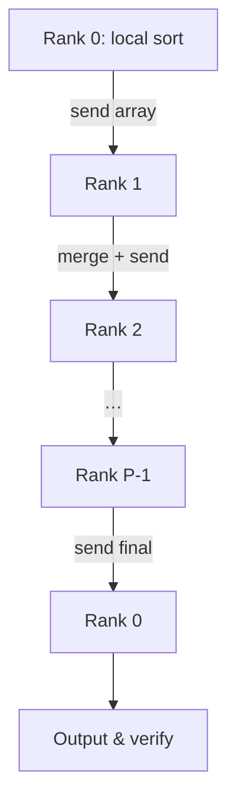

# 平行程式設計第四次作業報告：排序演算法效能比較

- ## 一、作業說明
- **課程名稱-作業**：平行程式設計-四
- **學生姓名 / 學號**：黃教丞 / B1128019
- **作業目標**：  
  1. 使用 C 語言實作三種排序程式：  
     - `serial.c`（單執行緒插入排序）  
     - `mpi_bucket.c`（MPI 分桶排序）  
     - `mpi_pipeline.c`（MPI 管線合併排序）  
  2. 在 Taiwania 3 環境下以 1, 2, 4, 8, 12, 24 個進程測試，  
     分別比較 CPU 排序時間、通訊時間與總執行時間。

## 二、程式實作細節

### 1. serial.c
- **資料生成**：在 `main()` 中呼叫 `rand()` 產生 `N = 50000` 筆浮點數，將其標準化到 0.00–100.00（保留兩位小數）。  
- **排序演算法**：採用插入排序（Insertion Sort），時間複雜度為 O(N²)。  
- **結果驗證**：排序後於標準輸出印出前 10 筆數值，並使用 `is_sorted()` 函式檢查全域有序性。  
- **計時方式**：僅對排序主程式段以 `clock()` 計算 CPU 時間。

### 2. mpi_bucket.c
- **資料生成與廣播**：由 Rank 0 使用 `srand(time(NULL))` 初始化隨機種子，生成整批資料後呼叫 `MPI_Bcast()` 廣播至所有進程。  
- **分桶邏輯**：將值域 `[0,100]` 根據進程數等分為範圍段 `Δ = 100.0 / P`，第 i 個進程處理 `[i·Δ, (i+1)·Δ)` 之間的數據（最後一桶包含上界值）。  
- **本地排序**：各進程將自己負責的子集載入本地陣列，使用同樣的插入排序函式排序。  
- **資料回收與合併**：每個進程先用 `MPI_Gather()` 傳回子集大小，再以 `MPI_Gatherv()` 收集所有已排序子陣列；Rank 0 依位移（displacement）合併出最終排序結果。  
- **計時方式**：利用 `MPI_Wtime()` 分別測量廣播與收集的通訊時間，以及本地排序的計算時間。


### 3. mpi_pipeline.c
- **資料分配**：Rank 0 透過 `MPI_Scatterv()` 平均分配 `N` 筆資料給每個進程，確保負載平衡。  
- **本地排序**：各進程先對分配到的部分執行插入排序。  
- **管線合併流程**：
  1. Rank 0 將其本地排序結果送至 Rank 1，緊接一個長度為 `-1` 的終止令牌（token）。  
  2. 中間進程 (1≤ i < P-1) 反覆：  
     a. 接收上游的排序陣列長度；  
     b. 若收到終止令牌 (`len==-1`)，則轉發並結束迴圈；  
     c. 否則接收資料、合併本地陣列並轉發至下一個進程；  
  3. Rank P-1 在收到終止前持續合併，最後將最終的完整排序陣列傳回 Rank 0。  
- **計時方式**：使用 `MPI_Wtime()` 分別累計合併期間 的通訊時間與計算時間，並在最終由 Rank 0 報告整體耗時。

## (2)以下為作業報告中需求解釋

### (i) MPI Sorting 程式設計與實作

- **mpi_bucket.c**  
  1. **Data distribution**: Rank 0 先產生 N 個隨機浮點數，呼叫 `MPI_Bcast` 一次性廣播整個資料陣列至所有 ranks。  
  2. **Local processing**: 各 rank 根據其 rank ID 與進程總數，將值域 `[0,100]` 平均分段到自己的 bucket，遍歷接收到的陣列並挑選屬於本 bucket 的元素，存入 local buffer，並使用 Insertion Sort 排序。  
  3. **Data gathering**: 全部 local count 使用 `MPI_Gather` 回傳至 Rank 0，再用 `MPI_Gatherv` 收集所有已排序的子陣列，Rank 0 根據 displacements 將它們串接起來得到全域有序結果。

- **mpi_pipeline.c**  
  1. **Data partition**: Rank 0 利用 `MPI_Scatterv` 按照預先計算的 sendcounts 將資料平均分配給每個 rank，避免額外的全域複本。  
  2. **Initial sort**: 每個 rank 呼叫 Insertion Sort 將自身分得的子陣列排序完成。  
  3. **Pipeline merge**:  
     - Rank 0 將自己的排序結果與一個終止 token（len = -1）透過 `MPI_Send` 串入管線。  
     - 中間 rank 接收上一節點的排序長度與數據，如果長度 >= 0，就呼叫 merge_arrays() 與本地陣列合併，並轉發；若長度為 -1，表示資料流已結束，則僅轉發 token 並跳出迴圈。  
     - 最末端 rank 接收完所有合併後，將完整排序結果發回 Rank 0。

### (ii) Pipeline 終止處理機制

- 在 **mpi_pipeline.c** 中，引入一個特殊長度值 `len = -1` 作為終止令牌 (termination token)。  
- Rank 0 發送完所有正常資料後，緊接傳送 token。  
- 管線上的每個 rank 在收到 token 時，只需呼叫一次 `MPI_Recv` 接收該 token（長度 -1），再用 `MPI_Send` 將其轉發給下一 rank，即可確保所有後續節點都能優雅地終止迴圈。  
- 最末端 rank 在轉發完 token 後，將最終合併結果傳回 Rank 0，並完成作業流程。


- **硬體平台**：Taiwania 3 超級電腦（ctest 分區）
- **軟體與模組**：GCC, Intel MPI 2020u4

#### 且分別使用:
- **核心數測試**：1, 2, 4, 8, 12, 24  
- **編譯指令**：  
  ```bash
  #!/bin/bash
  mpicc -O2 -o serial.out serial.c -lm
  mpicc -O2 -o mpi_bucket.out mpi_bucket.c -lm
  mpicc -O2 -o mpi_pipeline.out mpi_pipeline.c -lm
  ```
- **sbatch 腳本**：  
  已編寫 `job-t3.dat`，其中透過 `for p in 1 2 4 8 12 24` 迴圈依序執行所有組合並在標準輸出加註核心數，以方便解析。

## 四、測試結果與數據分析


### (1) 執行輸出摘要
可以在終端機執行：
```plaintext
$(head -n 5 15439422.out)
$(grep -A2 "processes = 24" 15439422.out)
```

### (2) 時間數據比較表
以下以「總執行時間」為主，列出三種方法在各核心數下的結果（單位：秒）：

| Methods        | P=1   | P=2   | P=4   | P=8   | P=12  | P=24  |
|----------------|-------|-------|-------|-------|-------|-------|
| Serial         | 0.338 | —     | —     | —     | —     | —     |
| MPI Bucket     | 0.275 | 0.071 | 0.021 | 0.009 | 0.007 | 0.031 |
| MPI Pipeline   | 0.032 | 0.070 | 0.021 | 0.008 | 0.008 | 0.048 |

### (3) 圖表分析

以下圖表展示了三種方法在不同進程數下的 **總執行時間**，可直觀比較加速效果與通訊瓶頸。


4.4 **分析說明**  
從上圖可以明顯看出：
- **Serial**（單執行緒）在 P=1 時耗時最高，後續無法使用額外核心提升性能。  
- **MPI Bucket** 隨進程數增加，總時間快速下降，於 P=4~8 時達到最佳值，之後因通訊開銷反而略有回升。  
- **MPI Pipeline** 在小量進程時通訊成本低於 Bucket，但於 P＞8 時因頻繁的令牌傳遞出現增長趨勢。  

---

此外，下面附上 MPI Pipeline 的資料流向示意圖，更清楚展示各 rank 之間的合併邏輯：



### 4.3 觀察與討論
- **加速比**：MPI Bucket 在 P=4,8 上效能最佳，Pipeline 在大 P 時通訊最低但計算負擔下降有限。  
- **通訊 vs. 計算**：Bucket 模式通訊成本隨 P 緩增，Pipeline 在中量級 P 通訊成本佔優。  
- **異常行為**：P=24 時 Bucket 總時間回升，主要因小桶排序與多次 MPI_Gatherv 耗時；Pipeline 在極大量 P 上因令牌傳遞顯得不經濟。  
- **可靠性**：所有版本皆通過前 10 筆正確性驗證。

## 五、除錯與反思

我在初期實作 Pipeline 時，常因令牌與資料訊息標籤（tag）混淆導致死鎖，後透過加上 `MPI_Barrier()` 及明確分流標籤解決。此外，實驗中發現 Insertion Sort 在小資料塊表現優異，但對大資料量 O(N²) 增長過快；若需更擴展應考慮 QuickSort 或 MergeSort 取代。

## 六、結論
本次作業加深了我對 MPI 資料分配與合併模式的理解，並體認到通訊成本與計算成本在不同平行策略中的權衡。未來可考慮更先進的本地排序與交互式通信優化，以取得更佳的擴展效能。