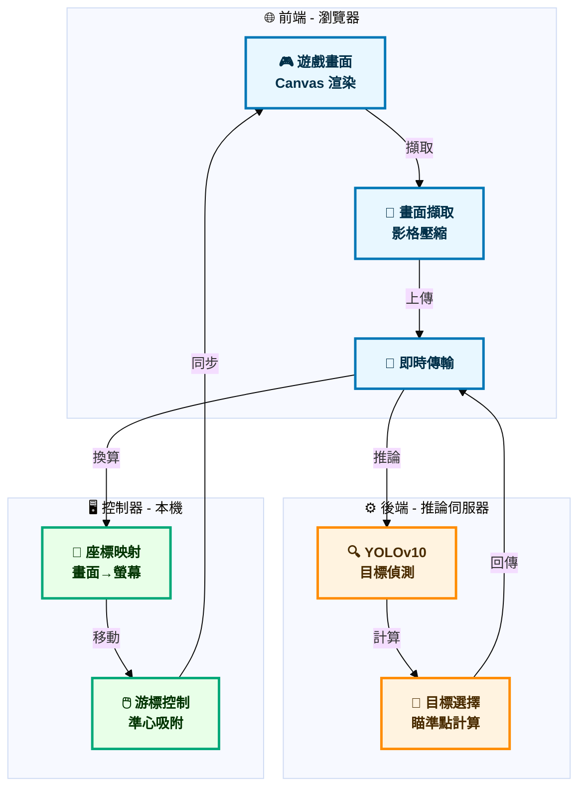

```mermaid
%%{init: {'theme':'base', 'themeVariables': {'fontSize':'14px'}, 'flowchart':{'nodeSpacing':50, 'rankSpacing':60}}}%%
flowchart TB

%% ===================== STYLES =====================
classDef frontend fill:#E8F7FF,stroke:#0077B6,stroke-width:2.5px,color:#003049,font-weight:bold
classDef backend fill:#FFF3E0,stroke:#FF8C00,stroke-width:2.5px,color:#4A2C00,font-weight:bold
classDef controller fill:#E8FFE8,stroke:#00A878,stroke-width:2.5px,color:#003300,font-weight:bold

%% ===================== 前端 =====================
subgraph FE["🌐 前端 - 瀏覽器"]
A["🎮 遊戲畫面<br/>Canvas 渲染"]:::frontend
B["📸 畫面擷取<br/>影格壓縮"]:::frontend
C["📡 即時傳輸"]:::frontend
end

%% ===================== 後端 =====================
subgraph BE["⚙️ 後端 - 推論伺服器"]
D["🔍 YOLOv10<br/>目標偵測"]:::backend
E["🎯 目標選擇<br/>瞄準點計算"]:::backend
end

%% ===================== 控制器 =====================
subgraph LC["🖥️ 控制器 - 本機"]
F["📐 座標映射<br/>畫面→螢幕"]:::controller
G["🖱️ 游標控制<br/>準心吸附"]:::controller
end

%% ===================== 流程 =====================
A -->|擷取| B
B -->|上傳| C
C -->|推論| D
D -->|計算| E
E -->|回傳| C
C -->|換算| F
F -->|移動| G
G -->|同步| A

```

## YOLO 歸一化座標格式

$$
\left(\frac{x + w/2}{bg_w}, \frac{y + h/2}{bg_h}, \frac{w}{bg_w}, \frac{h}{bg_h}\right)
$$

其中：
- $(x, y)$ 為邊界框左上角座標
- $(w, h)$ 為邊界框寬度和高度
- $(bg_w, bg_h)$ 為背景影像的寬度和高度

