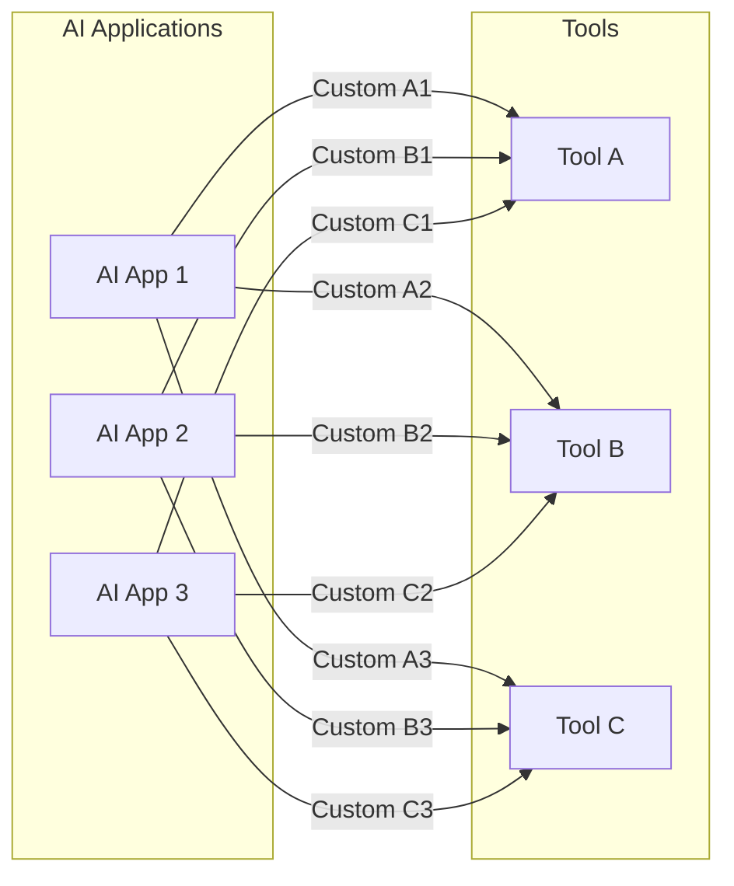
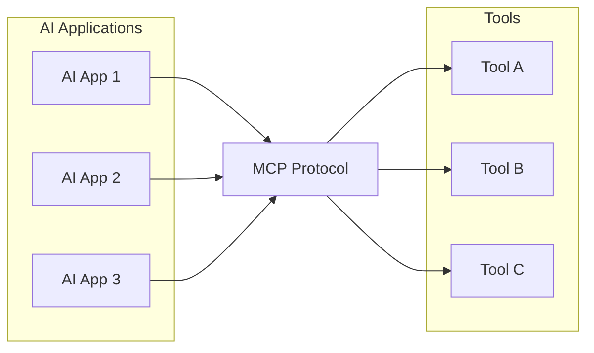
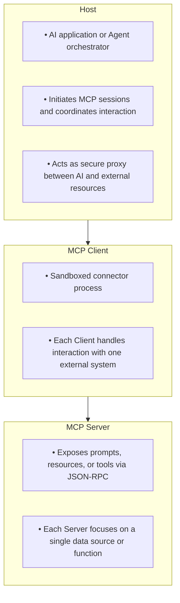
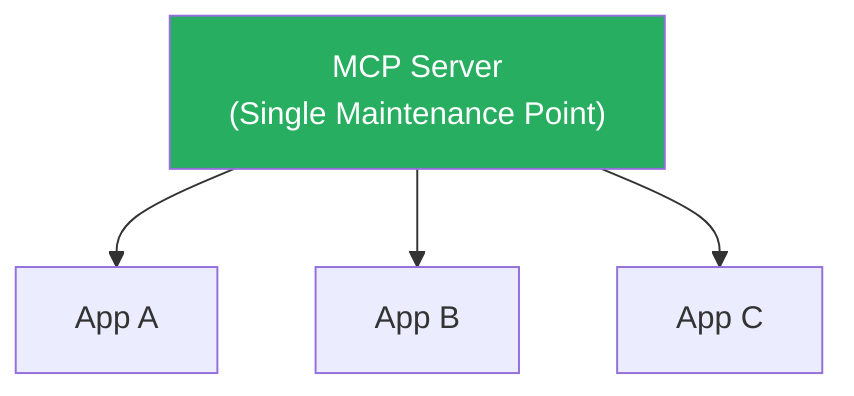
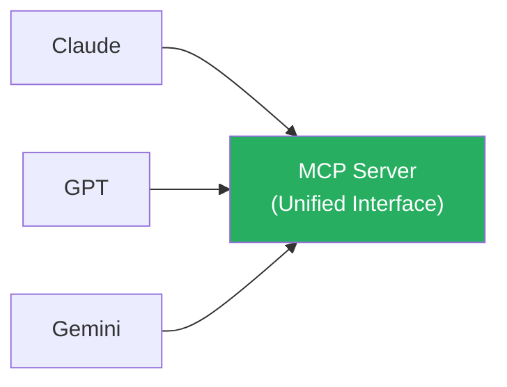
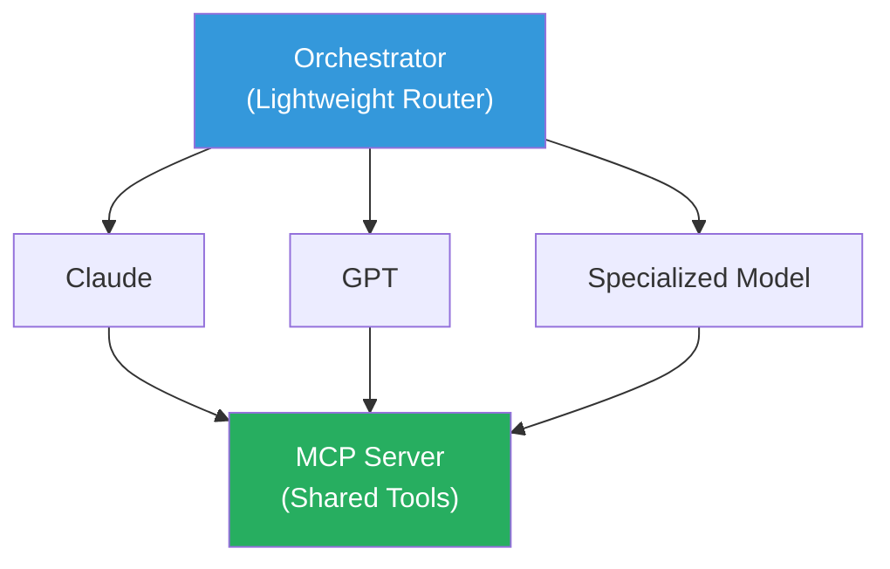

# Research Report: Benefits of MCP in Multi-LLM Systems

> **Core Research Question: What benefits does MCP provide when using Multi-LLM systems?**

**Research Date**: 2026-01-16
**Finish Date**: 2026-01-18

---

## Table of Contents

1. [MCP Overview and Background](#1-mcp-overview-and-background-01-mcp-overview)
2. [Complexity Analysis](#2-complexity-analysis-02-complexity-analysis)
3. [Maintenance Analysis](#3-maintenance-analysis-03-maintenance-analysis)
4. [Token Consumption Analysis](#4-token-consumption-analysis-04-token-consumption-analysis)
5. [Performance Analysis](#5-performance-analysis-05-performance-analysis)
6. [Comprehensive Conclusion](#6-comprehensive-conclusion)
7. [References](#7-references)

---

# 1. MCP Overview and Background (01-mcp-overview)

## 1.1 What is MCP?

**Model Context Protocol (MCP)** is an open standard and open-source framework released by Anthropic in November 2024, designed to standardize how AI systems (especially LLMs) integrate with external tools, systems, and data sources.

## 1.2 Core Problem MCP Solves

### The N×M Integration Problem

Before MCP, developers faced severe integration challenges:

**Traditional Approach (N×M Custom Integrations):**



**MCP Approach (N+M Standardized Integrations):**



### MCP's Solution

- **Standardized Interface**: Defines a universal protocol, replacing custom connectors
- **Dynamic Tool Discovery**: Agents can query available tools at runtime
- **Modular Design**: Decouples LLM applications from fixed toolsets
- **Extensibility**: Easily add tools without modifying application code

## 1.3 Technical Architecture

### Client-Host-Server Model

MCP adopts a three-tier architecture:



### Transport Layer

MCP is **transport-agnostic**, supporting:

| Transport | Use Case | Characteristics |
|-----------|----------|-----------------|
| STDIO | Local Server | Simple, low latency |
| HTTP + SSE | Remote communication | Supports standard authentication |
| WebSocket | Real-time applications | Low latency, bidirectional |

### Core Primitives

| Primitive | Description | Purpose |
|-----------|-------------|---------|
| **Tools** | Callable functions | Execute operations, query data |
| **Resources** | Readable data | Provide context information |
| **Prompts** | Predefined prompt templates | Standardize interaction patterns |

## 1.4 MCP vs Function Calling

| Aspect | Function Calling | MCP |
|--------|------------------|-----|
| **Purpose** | Convert prompts to executable instructions | Standardize instruction execution, enable cross-tool interoperability |
| **Architecture** | Embedded in LLM requests | Protocol-driven, independent architecture |
| **Portability** | Vendor-specific | Vendor-agnostic |
| **Tool Discovery** | Static definition | Dynamic discovery |
| **Best For** | Simple prototypes | Complex, scalable systems |

### Function Calling Limitations

```
OpenAI   → "Function Calling"
Anthropic → "Tool Use"
Google   → "Function Declarations"

Problem: Each vendor has different schema and API
Result: Switching vendors requires rewriting all function definitions
```

## 1.5 Industry Adoption Status

| Date | Vendor/Organization | Event |
|------|---------------------|-------|
| 2024/11 | Anthropic | Released MCP open-source protocol |
| 2025/03 | OpenAI | Officially adopted MCP |
| 2025 | Google DeepMind, Microsoft | Adopted MCP |
| 2025/12 | Linux Foundation | Took over MCP governance |

## 1.6 Security Considerations

### OAuth 2.1 Requirements (Updated 2025/06)

- MCP Server acts as OAuth Resource Server
- Must use PKCE (SHA-256)
- Must use HTTPS

### Primary Security Risks

1. OAuth Token exposure
2. MCP Server compromise
3. Indirect Prompt injection
4. Excessive permission aggregation

---

# 2. Complexity Analysis (02-complexity-analysis)

## 2.1 Core Question

> **Does adopting MCP increase system complexity?**

## 2.2 Complexity Source Analysis

### Initial Setup Complexity

**Learning Curve:**
- New protocol understanding: Client-Host-Server model
- JSON-RPC 2.0: Message format, error handling
- Security practices: OAuth 2.1, PKCE, token management

**Infrastructure Setup:**
```
Required Components:
├── MCP Host (AI application or orchestrator)
├── MCP Client (one per external system)
├── MCP Server (one per data source/tool)
├── Transport layer configuration
└── Security layer configuration
```

### Coordination Complexity (Multi-Agent)

```
Agent Count vs Coordination Complexity:

Single Agent: O(1)
Hub-and-Spoke: O(N)
Peer-to-Peer: O(N²) ← Needs management!
```

## 2.3 How MCP Reduces Complexity

### Eliminating the N×M Integration Problem

| Scenario | Traditional | MCP | Savings |
|----------|-------------|-----|---------|
| 5 Apps × 10 Tools | 50 integrations | 15 integrations | 70% |
| 10 Apps × 20 Tools | 200 integrations | 30 integrations | 85% |
| 20 Apps × 50 Tools | 1000 integrations | 70 integrations | 93% |

![[chart1_integration_savings.png | 700]]

### Standardized Interface

```python
# Traditional: Each service needs custom code
def call_service_a(params):
    # Service A specific authentication, API format, error handling
    pass

# MCP: Unified call interface
def call_mcp_tool(server, tool_name, params):
    return mcp_client.request(server, tool_name, params)
```

## 2.4 Multi-Agent Orchestration Patterns

| Pattern | Complexity | Use Case |
|---------|------------|----------|
| Single Agent | Low | Simple, single-domain tasks |
| Pipeline | Medium | Data transformation workflows |
| Hub-and-Spoke | Medium | Specialized division of labor |
| Peer-to-Peer | High | Highly collaborative tasks |

## 2.5 Complexity Evaluation Matrix

### By Timeline

| Aspect | Short-term (0-3mo) | Mid-term (3-12mo) | Long-term (1yr+) |
|--------|-------------------|-------------------|------------------|
| Learning Cost | High | Medium | Low |
| Integration Cost | Medium-High | Low | Very Low |
| Maintenance Cost | Medium | Low | Very Low |

### By System Scale

| Scale | MCP Benefit | Recommendation |
|-------|-------------|----------------|
| Small (<5 tools) | Potentially over-engineered | Evaluate Function Calling |
| Medium (5-20 tools) | Clear benefits | Adopt MCP |
| Large (20+ tools) | Essential choice | Strongly recommend MCP |

## 2.6 Conclusion

![[chart2_complexity_vs_scale.png]]

**Key Findings:**
- **Short-term complexity**: Increases (learning curve, infrastructure setup)
- **Long-term complexity**: Significantly decreases (standardization, modularity)
- **Crossover point**: Around 5-10 tools/integration points

---

# 3. Maintenance Analysis (03-maintenance-analysis)

## 3.1 Core Question

> **Does MCP help with system maintenance?**

## 3.2 Maintenance Challenges in Traditional Integration

### Code Duplication Problem

```
Traditional Architecture:

App A integrating Service X:
├── Authentication logic
├── Request formatting
├── Response parsing
└── Error handling

App B integrating Service X:
├── Authentication logic (duplicate!)
├── Request formatting (duplicate!)
├── Response parsing (duplicate!)
└── Error handling (duplicate!)

Problem: Bug fixes require modifications in multiple places
```

### Version Drift Problem

```
Time T1: All apps using Service X v1.0
Time T2:
├── App A: Updated to v2.0 ✓
├── App B: Still using v1.0 ✗
└── App C: Still using v1.0 ✗

Result: Inconsistent behavior, debugging difficulties
```

### Vendor Lock-in Cost

Switching LLM vendors = Rewriting all function definitions

## 3.3 How MCP Improves Maintainability

### Single Integration Point



**Advantage**: Bug fixes only need to update MCP Server

### Maintenance Workload Comparison

| Scenario | Traditional | MCP |
|----------|-------------|-----|
| Fix 1 bug | Modify N apps | Modify 1 Server |
| Update API version | Modify N apps | Modify 1 Server |
| Add new feature | Modify N apps | Modify 1 Server |

## 3.4 Interoperability Benefits

### Cross-LLM Interoperability



### Cost of Switching LLM Vendors

| Aspect | Traditional | MCP |
|--------|-------------|-----|
| Code changes | Extensive | Minimal |
| Test scope | Comprehensive | Limited |
| Risk | High | Low |

## 3.5 Maintainability Evaluation Matrix

| Maintenance Task | Without MCP | With MCP | Improvement |
|------------------|-------------|----------|-------------|
| Bug fixes | O(N) | O(1) | N times |
| Version upgrades | O(N) | O(1) | N times |
| Security patches | O(N) | O(1) | N times |

### Long-term Maintenance Cost Comparison

| Time Range | Traditional | MCP |
|------------|-------------|-----|
| Year 1 | Low | Medium (initial setup) |
| Year 2-3 | Medium | Low |
| Year 5+ | High (tech debt) | Low |

## 3.6 Conclusion

![[chart3_maintenance_cost.png]]

**Key Findings:**
- **Code maintenance**: Centralized, high benefit
- **Version management**: Standardized, high benefit
- **Long-term cost**: Significantly reduced

---

# 4. Token Consumption Analysis (04-token-consumption-analysis)

## 4.1 Core Question

> **Does using MCP consume more tokens?**

## 4.2 Token Consumption Research Data

| Research Metric | Value |
|-----------------|-------|
| Token inflation rate | 2x - 30x |
| Models tested | 9 |
| Primary overhead source | Tool schema |

### Main Sources of Token Inflation

```
MCP Additional Consumption:
├── 1. Tool Schema Definitions ← Primary overhead
├── 2. Interaction history serialization
├── 3. Recent output content
└── 4. System prompt repetition
```

## 4.3 Token Overhead of Tool Definitions

### Single Tool Consumption

| Tool Type | Token Consumption |
|-----------|-------------------|
| Simple tool | 50-100 tokens |
| Medium complexity | 100-300 tokens |
| Enterprise-grade tool | 500-1,000 tokens |

### Context Window Occupancy

| Tool Count | Total Tool Tokens | Claude Context % |
|------------|-------------------|------------------|
| 10 | 2,000 | ~1% |
| 50 | 10,000 | ~5% |
| 100 | 20,000 | ~10% |

## 4.4 Token Optimization Strategies

![[chart4_token_optimization.png]]

### Strategy 1: Dynamic Toolset

```
Traditional: Load all 100 tools every time → 20,000 tokens
Dynamic Toolset: Dynamically select 3-5 tools → 600-1,000 tokens
```

| Metric | Traditional | Dynamic Toolset | Improvement |
|--------|-------------|-----------------|-------------|
| Input Tokens | 20,000 | 800 | **-96%** |
| Total Tokens | 25,000 | 2,500 | **-90%** |

### Strategy 2: Schema Deduplication

Use JSON `$ref` references to reuse duplicate schema definitions.

| Schema Repetitions | Savings |
|--------------------|---------|
| 2 times | 40% |
| 5 times | 72% |
| 10 times | 84% |

### Strategy 3: MCP Caching

```
Cache Layers:
├── L1: Tool definition cache (session-level)
├── L2: Data cache (reduce repeated calls)
└── L3: Response cache (identical queries)
```

### Strategy 4: Code Execution Method

Have LLM generate code instead of multiple tool calls, reducing intermediate token consumption.

## 4.5 Cost Impact Analysis

Assuming Claude API pricing: $3/1M input, $15/1M output

| Daily Requests | Unoptimized Cost/Day | Optimized Cost/Day | Monthly Savings |
|----------------|----------------------|--------------------|-----------------|
| 1,000 | $75 | $7.5 | $2,025 |
| 10,000 | $750 | $75 | $20,250 |

## 4.6 Conclusion

| Aspect | Finding |
|--------|---------|
| Does it increase consumption? | Yes, baseline overhead 2x-30x |
| Primary cost source | Tool schema definitions |
| Can it be optimized? | Yes, can reduce by 90%+ |

---

# 5. Performance Analysis (05-performance-analysis)

## 5.1 Core Question

> **What is MCP's impact on system performance?**

## 5.2 Performance Evaluation Dimensions

| Metric | Definition | Importance |
|--------|------------|------------|
| Latency | Request to response time | User experience |
| Throughput | Requests per unit time | System capacity |
| Resource Efficiency | CPU/Memory/Token | Cost control |

## 5.3 Performance Advantages Analysis

### Reduced Latency

```
Traditional: LLM → App → Translation Layer → API Client → Service
MCP:        LLM → MCP Client → MCP Server → Service
                       ↑
              Standardization reduces translation layers
```

### Resource Efficiency Optimization

```
Traditional: Each app connects independently → N connections
MCP:        Shared Server → 1 connection

Resource Savings:
• Connections: From N to 1
• Memory: Shared connection state
• CPU: Reduced repeated authentication
```

## 5.4 Performance Challenges Analysis

### Communication Overhead

| Transport | Typical Latency |
|-----------|-----------------|
| STDIO | <1ms |
| HTTP (local) | 1-5ms |
| HTTP (remote) | 50-200ms |

### Agent Coordination Overhead

```
Single Agent: ~100ms
Multi-Agent (serial): ~300ms (cumulative)
Multi-Agent (parallel): ~150ms (including coordination overhead)
```

## 5.5 Performance Optimization Strategies

### Transport Layer Optimization

| Scenario | Recommended Protocol |
|----------|---------------------|
| Local development | STDIO |
| Container deployment | HTTP + Keep-Alive |
| Real-time applications | WebSocket |

### Agent Architecture Optimization

| Architecture | Latency | Throughput | Use Case |
|--------------|---------|------------|----------|
| Single Agent + Multi-tool | Low | Medium | Conversational apps |
| Hub-and-Spoke | Medium | High | Specialized work |
| Parallel Agents | Low | High | Independent subtasks |

## 5.6 Recommended Multi-LLM Architecture



**Design Principles:**
1. Lightweight Orchestrator → Reduce coordination latency
2. Shared MCP Server → Reduce connection overhead
3. Parallel LLM calls → Reduce total latency

## 5.7 Conclusion

| Aspect | Impact | Degree |
|--------|--------|--------|
| Overall Performance | Mixed | Neutral to Positive |
| Latency | Can be optimized | Neutral |
| Throughput | Positive | Positive |
| Resource Efficiency | Positive | Positive |

---

# 6. Comprehensive Conclusion

## 6.1 Four-Dimensional Summary

![[chart5_summary_radar.png | 500]]

| Dimension | Conclusion | Benefit Level |
|-----------|------------|---------------|
| **Complexity** | Short-term increase, long-term decrease; recommend adoption for >5-10 tools | Medium-High |
| **Maintenance** | Significant improvement; O(N) → O(1) | High |
| **Token** | 2x-30x overhead exists, but 90%+ optimizable | Medium (needs optimization) |
| **Performance** | Neutral to positive; attention to optimization needed | Medium-High |

## 6.2 Key Benefits of MCP

1. **Standardized Integration** - Eliminates M×N problem, simplifies development and maintenance
2. **Interoperability** - Seamless collaboration across LLM vendors
3. **Ecosystem Support** - Major vendors (OpenAI, Google, Microsoft) adopted
4. **Future Adaptability** - New tools/models can be easily integrated

## 6.3 Potential Trade-offs of MCP

1. **Initial Setup Cost** - Learning curve and infrastructure investment
2. **Token Overhead** - Requires optimization strategies (can reduce 90%+)
3. **Coordination Complexity** - Multi-agent architecture requires proper design

## 6.4 Recommendations

| Project Scale | Recommendation |
|---------------|----------------|
| Small (<5 tools) | Evaluate needs, Function Calling may suffice |
| Medium (5-20 tools) | Recommend adopting MCP |
| Large (20+ tools) | Strongly recommend MCP |
| Multi-LLM | Recommend MCP (simplifies interoperability) |

---

# 7. References

## Official Documentation
- [Model Context Protocol Specification](https://modelcontextprotocol.io/specification/2025-11-25)
- [MCP Architecture Overview](https://modelcontextprotocol.io/docs/learn/architecture)

## Academic Research
- [Advancing Multi-Agent Systems Through MCP](https://arxiv.org/html/2504.21030v1)
- [Network and Systems Performance Characterization of MCP-Enabled LLM Agents](https://arxiv.org/html/2511.07426)

## Industry Analysis
- [What is MCP? - Google Cloud](https://cloud.google.com/discover/what-is-model-context-protocol)
- [Function Calling vs MCP - Descope](https://www.descope.com/blog/post/mcp-vs-function-calling)

## Token Optimization
- [The Hidden Cost of MCP](https://www.arsturn.com/blog/hidden-cost-of-mcp-monitor-reduce-token-usage)
- [Reducing MCP Token Usage by 100x](https://www.speakeasy.com/blog/how-we-reduced-token-usage-by-100x-dynamic-toolsets-v2)
- [Code Execution with MCP - Anthropic](https://www.anthropic.com/engineering/code-execution-with-mcp)

## Implementation Guides
- [MCP & Multi-Agent AI: Building Collaborative Intelligence](https://onereach.ai/blog/mcp-multi-agent-ai-collaborative-intelligence/)
- [When to Choose Single Agent + MCP or Multi Agent + A2A](https://www.cdata.com/blog/choosing-single-agent-with-mcp-vs-multi-agent-with-a2a)
