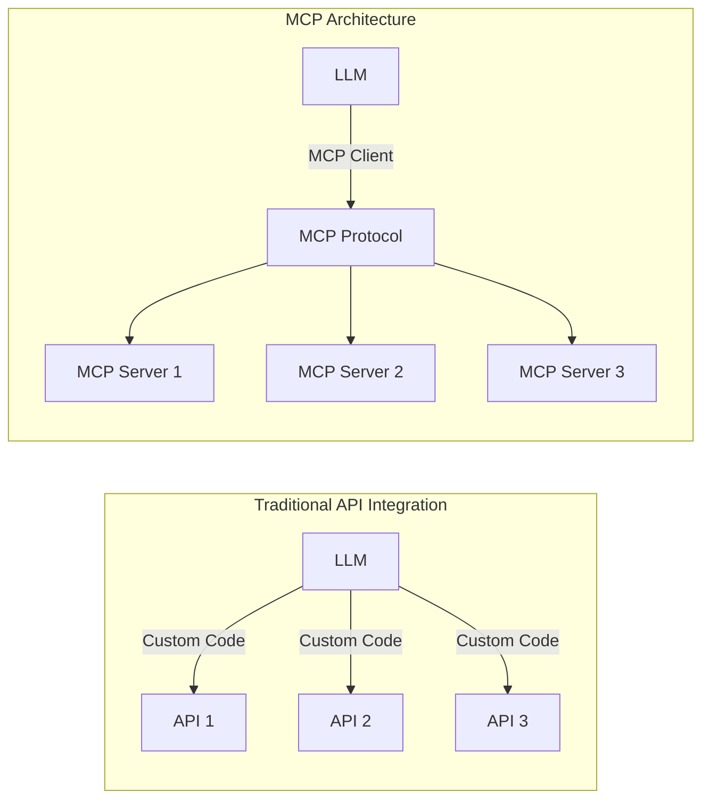
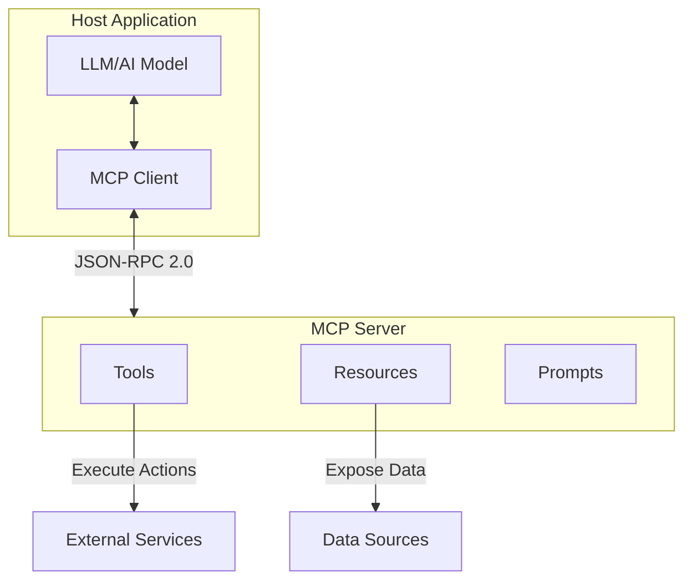
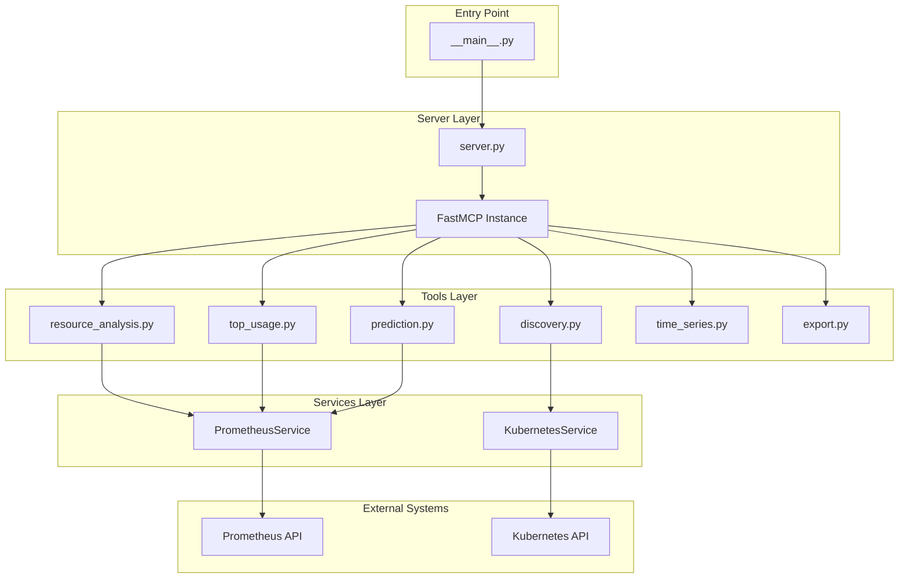
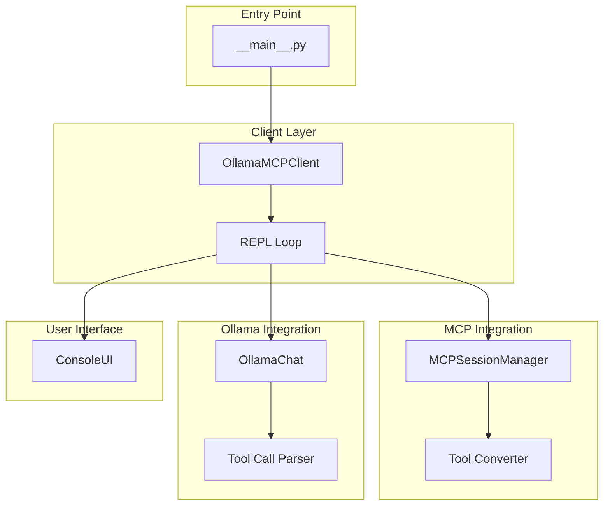
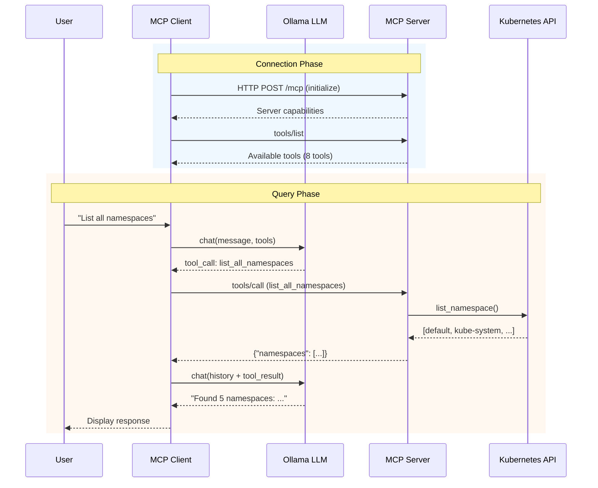
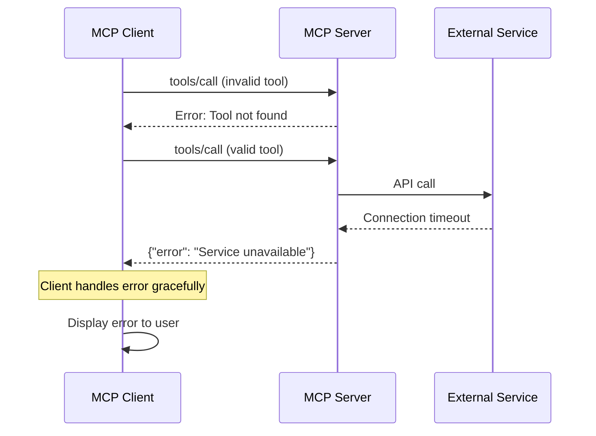
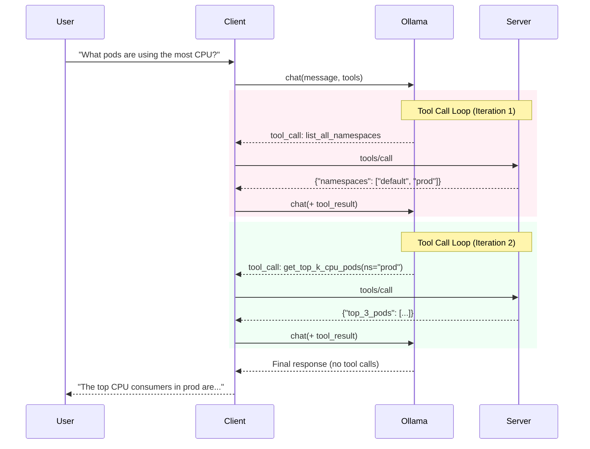
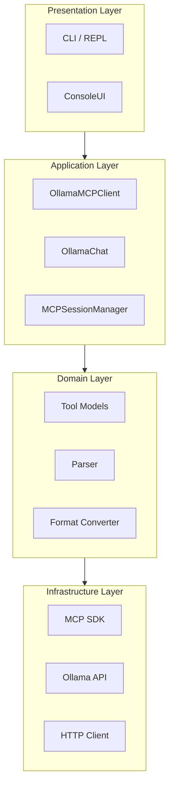

# MCP Implementation Technical Report

A comprehensive analysis of Model Context Protocol (MCP) architecture and implementation based on a real-world Kubernetes monitoring system.

---

## Table of Contents

1. [Part 1: MCP Protocol Overview](#part-1-mcp-protocol-overview)
2. [Part 2: Server Implementation Analysis](#part-2-server-implementation-analysis)
3. [Part 3: Client Implementation Analysis](#part-3-client-implementation-analysis)
4. [Part 4: Server-Client Interaction Flow](#part-4-server-client-interaction-flow)
5. [Part 5: Design Patterns and Best Practices](#part-5-design-patterns-and-best-practices)

---

## Part 1: MCP Protocol Overview

### 1.1 What is Model Context Protocol (MCP)?

Model Context Protocol (MCP) is an open protocol developed by Anthropic that standardizes how applications provide context to large language models (LLMs). It enables seamless integration between AI applications and external data sources, tools, and services.

**Key Design Goals:**

| Goal | Description |
|------|-------------|
| **Standardization** | Unified interface for LLM-tool interactions |
| **Composability** | Build complex AI systems from simple, reusable components |
| **Interoperability** | Language and framework agnostic communication |
| **Security** | Controlled access to external resources |

### 1.2 MCP vs Traditional APIs



| Aspect | Traditional API | MCP |
|--------|----------------|-----|
| Integration | Custom per API | Standardized protocol |
| Tool Discovery | Manual documentation | Automatic via `tools/list` |
| Schema Definition | Varies by API | JSON Schema standard |
| Transport | HTTP only | stdio, HTTP, SSE, WebSocket |

### 1.3 Core Architecture

MCP follows a client-server architecture with the following components:



**Component Roles:**

- **Host Application**: The application that hosts the LLM and MCP client
- **MCP Client**: Connects to servers, discovers capabilities, invokes tools
- **MCP Server**: Exposes tools, resources, and prompts to clients
- **Transport Layer**: Handles communication (stdio, HTTP, SSE)

### 1.4 Communication Protocol: JSON-RPC 2.0

All MCP messages follow the JSON-RPC 2.0 specification:

**Request Format:**
```json
{
  "jsonrpc": "2.0",
  "id": 1,
  "method": "tools/call",
  "params": {
    "name": "get_weather",
    "arguments": { "location": "Tokyo" }
  }
}
```

**Response Format:**
```json
{
  "jsonrpc": "2.0",
  "id": 1,
  "result": {
    "content": [
      { "type": "text", "text": "Temperature: 22°C" }
    ]
  }
}
```

**Error Response:**
```json
{
  "jsonrpc": "2.0",
  "id": 1,
  "error": {
    "code": -32600,
    "message": "Invalid Request"
  }
}
```

### 1.5 Transport Modes

MCP supports multiple transport mechanisms:

| Transport | Use Case | Characteristics |
|-----------|----------|-----------------|
| **stdio** | Local integration | Process communication via stdin/stdout |
| **HTTP** | Remote servers | RESTful HTTP endpoints |
| **SSE** | Real-time updates | Server-Sent Events for streaming |
| **streamable-http** | Production | HTTP with streaming support |

### 1.6 Core Concepts

#### Tools

Tools are functions that the LLM can invoke to perform actions:

```json
{
  "name": "list_all_namespaces",
  "description": "List all available Kubernetes namespaces",
  "inputSchema": {
    "type": "object",
    "properties": {},
    "required": []
  }
}
```

#### Resources

Resources expose data that can be read by the LLM:

```json
{
  "uri": "file:///config/settings.json",
  "name": "Application Settings",
  "mimeType": "application/json"
}
```

#### Prompts

Prompts are reusable templates for LLM interactions:

```json
{
  "name": "analyze_metrics",
  "description": "Analyze resource metrics for a pod",
  "arguments": [
    { "name": "namespace", "required": true },
    { "name": "pod_name", "required": true }
  ]
}
```

---

## Part 2: Server Implementation Analysis

This section analyzes the `k8s-monitor` MCP server implementation.

### 2.1 Architecture Overview



### 2.2 FastMCP Framework

The server uses the FastMCP framework from the official MCP Python SDK:

```python
# server.py
from mcp.server.fastmcp import FastMCP

def create_server() -> FastMCP:
    """Create and configure the MCP server with all tools registered."""
    mcp = FastMCP("K8s Monitoring MCP Server")

    # Register all tools via modular registration functions
    register_discovery_tools(mcp)
    register_resource_analysis_tools(mcp)
    register_top_usage_tools(mcp)
    register_prediction_tools(mcp)
    register_time_series_tools(mcp)
    register_export_tools(mcp)

    return mcp
```

**Key FastMCP Features:**

| Feature | Description |
|---------|-------------|
| `@mcp.tool()` decorator | Automatic tool registration |
| `streamable_http_app()` | ASGI app for HTTP transport |
| Auto serialization | Return values converted to JSON |
| Schema inference | JSON Schema generated from type hints |

### 2.3 Tool Registration Pattern

Each tool module follows a consistent registration pattern:

```python
# tools/discovery.py
from mcp.server.fastmcp import FastMCP

def register_discovery_tools(mcp: FastMCP):
    """Register Kubernetes discovery tools with MCP server."""

    @mcp.tool()
    def list_all_namespaces() -> str:
        """List all available Kubernetes namespaces."""
        try:
            from ..services.kubernetes import KubernetesService, KUBERNETES_AVAILABLE

            if not KUBERNETES_AVAILABLE:
                return json.dumps({"error": "Kubernetes client is not available."})

            k8s = KubernetesService()
            namespaces = k8s.list_namespaces()
            return json.dumps({
                "namespaces": namespaces,
                "count": len(namespaces)
            })
        except Exception as e:
            return json.dumps({"error": str(e)})

    @mcp.tool()
    def list_pods_in_namespace(namespace: str, running_only: bool = True) -> str:
        """List all pods in a specific namespace.

        Args:
            namespace: The Kubernetes namespace to list pods from
            running_only: If True, only return pods in Running state
        """
        # Implementation...
```

**Pattern Benefits:**

1. **Modular**: Each tool category in separate file
2. **Testable**: Tools can be registered to test FastMCP instance
3. **Type Safe**: Parameters inferred from function signature
4. **Self-documenting**: Docstrings become tool descriptions

### 2.4 Available Tools

| Tool | Module | Description |
|------|--------|-------------|
| `list_all_namespaces` | discovery.py | List K8s namespaces |
| `list_pods_in_namespace` | discovery.py | List pods in namespace |
| `analyze_resource_usage` | resource_analysis.py | CPU/memory statistics |
| `get_top_k_cpu_pods` | top_usage.py | Top K CPU consumers |
| `get_top_k_memory_pods` | top_usage.py | Top K memory consumers |
| `predict_pod_resource_usage` | prediction.py | ARIMA-based prediction |
| `plot_time_series_usage` | time_series.py | Grafana chart URL |
| `generate_csv_link` | export.py | CSV download link |

### 2.5 Transport Implementation

```python
# server.py
def run_server(
    transport: str = "stdio",
    host: str = "0.0.0.0",
    port: int = 8080
):
    """Run the MCP server with specified transport."""
    mcp = create_server()

    if transport == "stdio":
        # Standard I/O for MCP client integration
        mcp.run(transport="stdio")
    elif transport in ("http", "streamable-http"):
        # HTTP transport with uvicorn
        import uvicorn
        app = mcp.streamable_http_app()
        uvicorn.run(app, host=host, port=port)
    else:
        mcp.run(transport=transport)
```

### 2.6 Service Layer Design

**PrometheusService:**

```python
# services/prometheus.py
class PrometheusService:
    """Prometheus HTTP API client."""

    def __init__(self, base_url: str = None, timeout: int = None):
        self.base_url = base_url or settings.prometheus_url
        self.timeout = timeout or settings.prometheus_timeout

    def query(self, promql: str) -> dict:
        """Execute instant query."""
        return self._request("/api/v1/query", {"query": promql})

    def query_range(self, promql: str, start: datetime, end: datetime, step: str) -> dict:
        """Execute range query."""
        params = {
            "query": promql,
            "start": start.isoformat() + "Z",
            "end": end.isoformat() + "Z",
            "step": step
        }
        return self._request("/api/v1/query_range", params)
```

**KubernetesService:**

```python
# services/kubernetes.py
class KubernetesService:
    """Kubernetes API client wrapper."""

    def __init__(self, in_cluster: bool = None):
        if in_cluster:
            config.load_incluster_config()  # Inside K8s cluster
        else:
            config.load_kube_config()        # Local development
        self.core_v1 = client.CoreV1Api()

    def list_namespaces(self) -> list[str]:
        """List all namespaces in the cluster."""
        namespaces = self.core_v1.list_namespace()
        return [ns.metadata.name for ns in namespaces.items]
```

---

## Part 3: Client Implementation Analysis

This section analyzes the `ollama-client` MCP client implementation.

### 3.1 Architecture Overview



### 3.2 MCP Session Management

The client uses an async context manager for connection lifecycle:

```python
# mcp/session.py
from mcp import ClientSession
from mcp.client.streamable_http import streamablehttp_client

@dataclass(frozen=True)
class MCPTool:
    """Immutable representation of an MCP tool."""
    name: str
    description: str
    input_schema: dict

@dataclass(frozen=True)
class ToolResult:
    """Immutable representation of a tool execution result."""
    success: bool
    content: str
    error: str | None = None

class MCPSessionManager:
    """Manages MCP client session lifecycle and tool operations."""

    def __init__(self, mcp_url: str, timeout: int = 30):
        self._mcp_url = mcp_url
        self._session: ClientSession | None = None
        self._tools: list[MCPTool] = []

    @asynccontextmanager
    async def connect(self) -> AsyncIterator[MCPSessionManager]:
        """Establish connection to MCP server."""
        async with streamablehttp_client(self._mcp_url) as (read, write, _):
            async with ClientSession(read, write) as session:
                await session.initialize()
                self._session = session
                await self._discover_tools()
                yield self
                # Cleanup on exit
                self._session = None
                self._tools = []
```

### 3.3 Tool Discovery and Conversion

**Discovery Process:**

```python
async def _discover_tools(self) -> None:
    """Discover available tools from MCP server."""
    result = await self._session.list_tools()
    self._tools = [
        MCPTool(
            name=tool.name,
            description=tool.description or "",
            input_schema=tool.inputSchema or {"type": "object", "properties": {}},
        )
        for tool in result.tools
    ]
```

**Format Conversion (MCP → Ollama):**

```python
# mcp/tools.py
def convert_to_ollama_format(mcp_tools: list[MCPTool]) -> list[dict]:
    """Convert MCP tools to Ollama-compatible format."""
    return [
        {
            "type": "function",
            "function": {
                "name": tool.name,
                "description": tool.description,
                "parameters": tool.input_schema,
            },
        }
        for tool in mcp_tools
    ]
```

### 3.4 LLM Integration with Tool Calling

```python
# ollama/chat.py
class OllamaChat:
    """Manages Ollama chat sessions with tool calling support."""

    def __init__(self, model: str, tools: list[dict], max_iterations: int = 10):
        self._model = model
        self._tools = tools
        self._max_iterations = max_iterations
        self._history: list[dict] = []

    async def chat(self, tool_executor: Callable[[str, dict], Awaitable[str]]) -> str:
        """Execute chat completion with automatic tool calling loop."""
        iterations = 0

        while iterations < self._max_iterations:
            iterations += 1

            # 1. Call Ollama API
            response = self._call_ollama()
            tool_calls = self._extract_tool_calls(response)

            # 2. If no tool calls, return final response
            if not tool_calls:
                final_content = response.message.content or ""
                self.add_assistant_message(final_content)
                return final_content

            # 3. Add assistant message with tool calls
            self.add_assistant_message(response.message.content or "")

            # 4. Execute each tool and add results
            for tool_call in tool_calls:
                result = await tool_executor(tool_call.name, tool_call.arguments)
                self.add_tool_result(tool_call.name, result)

            # 5. Loop back to step 1 with tool results

        return "[Max tool call iterations reached]"
```

### 3.5 Tool Call Parsing

The client supports two formats for tool calls:

**1. Native Format (llama3.2):**
```python
if response.message.tool_calls:
    return [
        ParsedToolCall(name=tc.function.name, arguments=tc.function.arguments)
        for tc in response.message.tool_calls
    ]
```

**2. Text Format (granite3.2:8b):**
```python
# ollama/parser.py
def parse_tool_calls_from_text(content: str) -> list[ParsedToolCall]:
    """Parse tool calls from model text output.

    Supported formats:
    1. <tool_call>[{"name": "...", "arguments": {...}}]</tool_call>
    2. Raw JSON array
    """
    # Strategy 1: XML format
    pattern = r"<tool_call>\s*(\[.*?\])\s*(?:</tool_call>)?"
    match = re.search(pattern, content, re.DOTALL)
    if match:
        return _json_to_tool_calls(match.group(1))

    # Strategy 2: Raw JSON array
    return _parse_raw_json_array(content)
```

### 3.6 Conversation History Management

```python
def add_user_message(self, content: str) -> None:
    self._history.append({"role": "user", "content": content})

def add_assistant_message(self, content: str) -> None:
    self._history.append({"role": "assistant", "content": content})

def add_tool_result(self, tool_name: str, result: str) -> None:
    self._history.append({
        "role": "tool",
        "content": result,
        "tool_name": tool_name
    })
```

---

## Part 4: Server-Client Interaction Flow

### 4.1 Complete Interaction Sequence



### 4.2 Detailed Request-Response Examples

#### Example 1: Tool Discovery

**Request:**
```json
{
  "jsonrpc": "2.0",
  "id": 1,
  "method": "tools/list",
  "params": {}
}
```

**Response:**
```json
{
  "jsonrpc": "2.0",
  "id": 1,
  "result": {
    "tools": [
      {
        "name": "list_all_namespaces",
        "description": "List all available Kubernetes namespaces.",
        "inputSchema": {
          "type": "object",
          "properties": {},
          "required": []
        }
      },
      {
        "name": "list_pods_in_namespace",
        "description": "List all pods in a specific namespace.",
        "inputSchema": {
          "type": "object",
          "properties": {
            "namespace": { "type": "string" },
            "running_only": { "type": "boolean", "default": true }
          },
          "required": ["namespace"]
        }
      }
    ]
  }
}
```

#### Example 2: Tool Invocation

**Request:**
```json
{
  "jsonrpc": "2.0",
  "id": 2,
  "method": "tools/call",
  "params": {
    "name": "list_pods_in_namespace",
    "arguments": {
      "namespace": "default",
      "running_only": true
    }
  }
}
```

**Response:**
```json
{
  "jsonrpc": "2.0",
  "id": 2,
  "result": {
    "content": [
      {
        "type": "text",
        "text": "{\"namespace\": \"default\", \"pods\": [\"nginx-pod\", \"redis-pod\"], \"count\": 2}"
      }
    ]
  }
}
```

### 4.3 Error Handling Flow



### 4.4 Multi-Turn Conversation with Tools



---

## Part 5: Design Patterns and Best Practices

### 5.1 Functional Programming Principles

#### Immutable Data Structures

```python
# Using frozen dataclasses for immutability
@dataclass(frozen=True)
class MCPTool:
    """Immutable representation of an MCP tool."""
    name: str
    description: str
    input_schema: dict

@dataclass(frozen=True)
class ToolResult:
    """Immutable representation of a tool execution result."""
    success: bool
    content: str
    error: str | None = None

@dataclass(frozen=True)
class ParsedToolCall:
    """Immutable representation of a parsed tool call."""
    name: str
    arguments: dict
```

**Benefits:**
- Thread-safe by design
- Easier to reason about state
- Prevents accidental mutations

#### Pure Functions

```python
# Pure function - no side effects, same input = same output
def convert_to_ollama_format(mcp_tools: list[MCPTool]) -> list[dict]:
    """Convert MCP tools to Ollama-compatible format."""
    return [
        {
            "type": "function",
            "function": {
                "name": tool.name,
                "description": tool.description,
                "parameters": tool.input_schema,
            },
        }
        for tool in mcp_tools
    ]

# Pure function for parsing
def parse_tool_calls_from_text(content: str) -> list[ParsedToolCall]:
    """Parse tool calls from text - no external state dependencies."""
    # Implementation uses only input parameter
    ...
```

### 5.2 Layered Architecture



### 5.3 Separation of Concerns

| Layer | Responsibility | Example Files |
|-------|----------------|---------------|
| **Entry Point** | CLI parsing, configuration | `__main__.py` |
| **Orchestration** | Workflow coordination | `client.py` |
| **Integration** | External service communication | `session.py`, `chat.py` |
| **Domain Logic** | Business rules, transformations | `parser.py`, `tools.py` |
| **Services** | API wrappers | `prometheus.py`, `kubernetes.py` |
| **Configuration** | Environment management | `config.py` |

### 5.4 Async Context Manager Pattern

```python
class MCPSessionManager:
    @asynccontextmanager
    async def connect(self) -> AsyncIterator[MCPSessionManager]:
        """Establish connection with automatic cleanup."""
        async with streamablehttp_client(self._mcp_url) as (read, write, _):
            async with ClientSession(read, write) as session:
                await session.initialize()
                self._session = session
                await self._discover_tools()

                try:
                    yield self  # Return connected manager
                finally:
                    # Guaranteed cleanup
                    self._session = None
                    self._tools = []
```

**Usage:**
```python
manager = MCPSessionManager(url="http://localhost:8080/mcp")
async with manager.connect() as connected:
    tools = connected.get_tools()
    result = await connected.call_tool("list_all_namespaces", {})
# Automatic cleanup after exiting context
```

### 5.5 Callback-Based Tool Execution

```python
# Tool executor as a closure
def _create_tool_executor(self, mcp_manager: MCPSessionManager):
    """Create tool executor with MCP manager captured in closure."""
    async def executor(name: str, arguments: dict) -> str:
        self._ui.print_tool_call(name, arguments)
        result = await mcp_manager.call_tool(name, arguments)

        if result.success:
            self._ui.print_tool_result(name, result.content)
            return result.content
        else:
            self._ui.print_tool_error(name, result.error or "Unknown error")
            return f"Error: {result.error}"

    return executor

# Usage in chat
response = await self._chat.chat(
    tool_executor=self._create_tool_executor(mcp_manager)
)
```

### 5.6 Configuration Management

```python
# Using pydantic-settings for type-safe configuration
from pydantic_settings import BaseSettings, SettingsConfigDict

class Settings(BaseSettings):
    """Application settings loaded from environment variables."""

    model_config = SettingsConfigDict(
        env_file=".env",
        env_file_encoding="utf-8",
        env_prefix="OLLAMA_MCP_"  # Environment variable prefix
    )

    # MCP Server
    mcp_url: str = Field(default="http://127.0.0.1:8080/mcp")
    mcp_timeout: int = Field(default=30)

    # Ollama
    ollama_model: str = Field(default="llama3.2:latest")
    ollama_timeout: int = Field(default=120)

    # Control
    max_iterations: int = Field(default=10)
    verbose: bool = Field(default=False)
```

### 5.7 Error Handling Strategy

```python
# Structured error handling with Result type
@dataclass(frozen=True)
class ToolResult:
    success: bool
    content: str
    error: str | None = None

async def call_tool(self, name: str, arguments: dict) -> ToolResult:
    """Execute tool with structured error handling."""
    if not self._session:
        return ToolResult(success=False, content="", error="Session not connected")

    try:
        result = await self._session.call_tool(name, arguments)
        content_parts = [item.text for item in result.content if hasattr(item, "text")]
        return ToolResult(success=True, content="\n".join(content_parts))
    except Exception as e:
        logger.error(f"Tool call failed: {name} - {e}")
        return ToolResult(success=False, content="", error=str(e))
```

### 5.8 Testing Strategy

```python
# Tool testing pattern
class TestDiscoveryTools:
    def test_list_all_namespaces_returns_json(self):
        """Test tool registration and execution."""
        from mcp.server.fastmcp import FastMCP

        # Create isolated test server
        mcp = FastMCP(name="test")
        register_discovery_tools(mcp)

        # Find registered tool
        tool = None
        for t in mcp._tool_manager._tools.values():
            if t.name == "list_all_namespaces":
                tool = t
                break

        assert tool is not None

        # Execute and validate
        result = tool.fn()
        parsed = json.loads(result)
        assert "namespaces" in parsed or "error" in parsed
```

---

## Summary

This report analyzed the MCP (Model Context Protocol) implementation through a real-world Kubernetes monitoring system consisting of:

1. **MCP Server (k8s-monitor)**: A FastMCP-based server exposing 8 tools for Kubernetes monitoring, resource analysis, and prediction.

2. **MCP Client (ollama-client)**: An interactive CLI client that integrates Ollama LLM with MCP tools for intelligent queries.

**Key Architectural Decisions:**

| Decision | Rationale |
|----------|-----------|
| FastMCP framework | Simplified tool registration, automatic schema generation |
| Modular tool design | Separation of concerns, independent testing |
| Async context managers | Clean resource lifecycle management |
| Immutable data structures | Thread safety, predictable behavior |
| Callback-based execution | Flexible tool execution, testability |

**Future Considerations:**

- Implement MCP Resources for exposing K8s configurations
- Add MCP Prompts for common query templates
- Support WebSocket transport for real-time monitoring
- Implement tool caching for improved performance

---

## References

- [Model Context Protocol Specification](https://modelcontextprotocol.io/specification)
- [MCP Python SDK](https://github.com/modelcontextprotocol/python-sdk)
- [FastMCP Documentation](https://github.com/modelcontextprotocol/python-sdk/tree/main/src/mcp/server/fastmcp)
- [Ollama Tool Calling](https://ollama.com/blog/tool-support)
