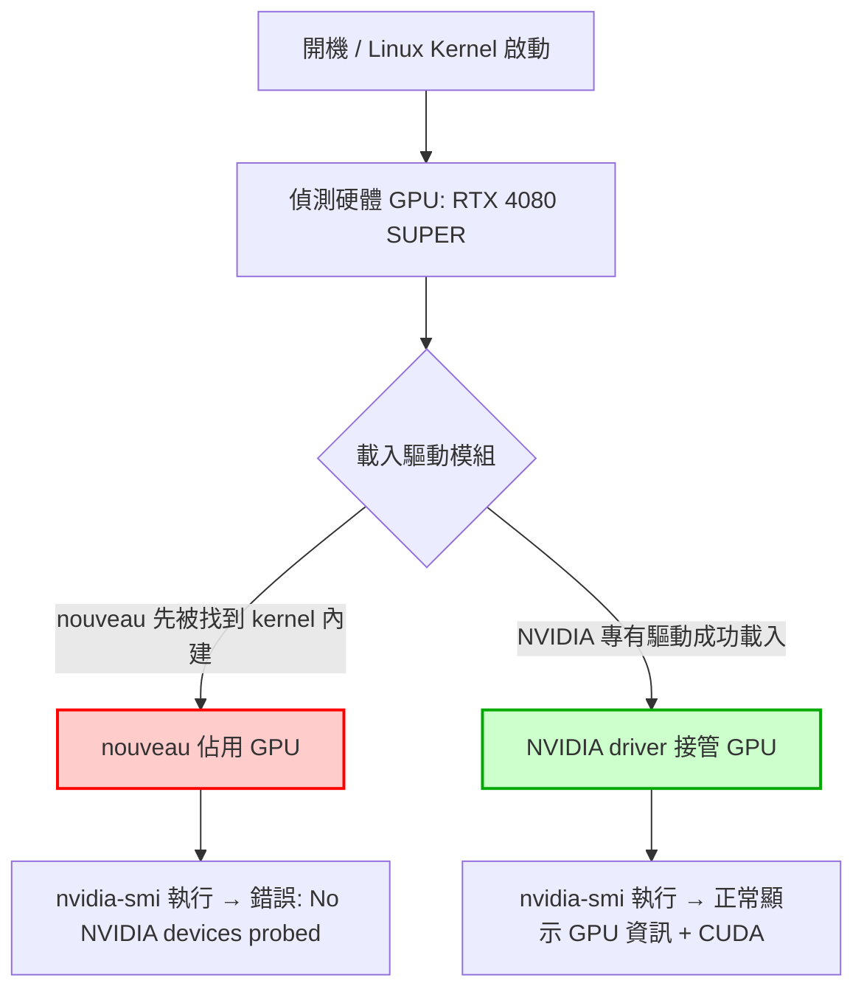

```mermaid
flowchart TD

A[開機 / Linux Kernel 啟動] --> B[偵測硬體 GPU: RTX 4080 SUPER]
B --> C{載入驅動模組}
C -->|nouveau 先被找到 kernel 內建| D[nouveau 佔用 GPU]
C -->|NVIDIA 專有驅動成功載入| E[NVIDIA driver 接管 GPU]

D --> F["nvidia-smi 執行 → 錯誤: No NVIDIA devices probed"]
E --> G["nvidia-smi 執行 → 正常顯示 GPU 資訊 + CUDA"]

style D fill:#ffcccc,stroke:#ff0000,stroke-width:2px
style E fill:#ccffcc,stroke:#00aa00,stroke-width:2px


```