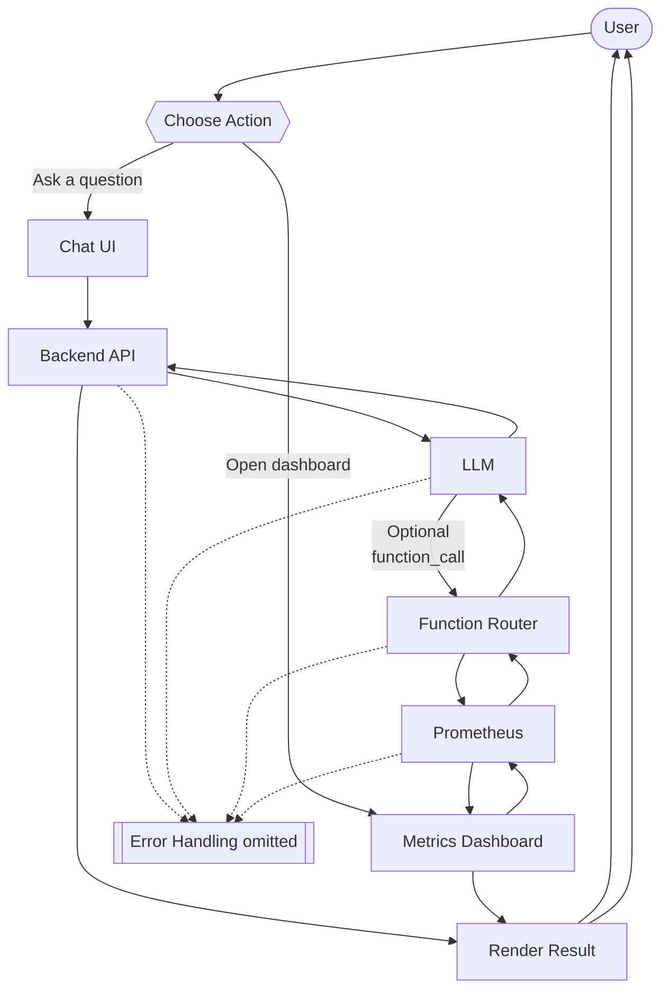
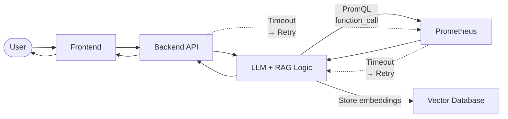
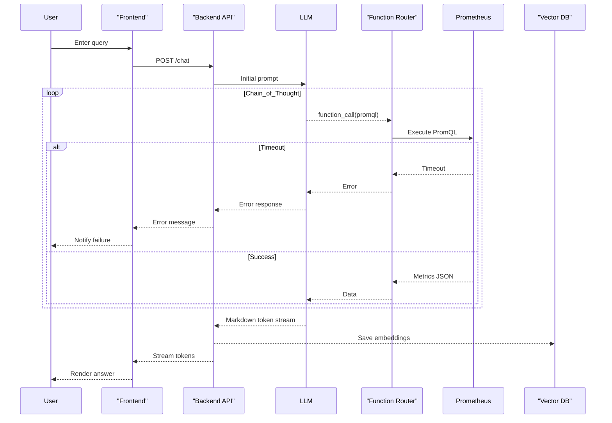
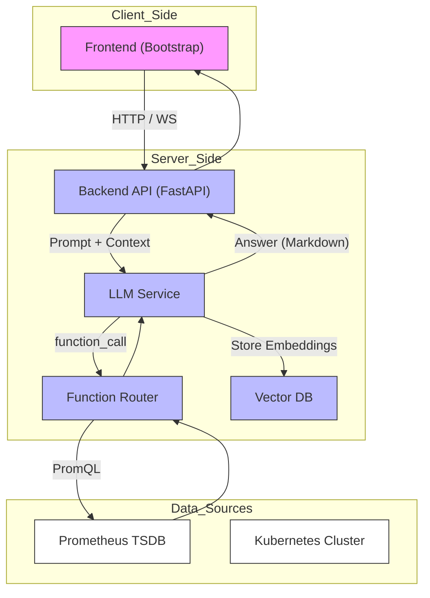

```mermaid
%% 1. User Interaction Flowchart (Flowchart — Top → Down)
flowchart TD
    %% Nodes
    USER([User])
    DECIDE{{Choose Action}}
    CHAT[Chat UI]
    DASH[Metrics Dashboard]
    API[Backend API]
    LLM[LLM]
    FUNC[Function Router]
    PROM[Prometheus]
    DISPLAY[Render Result]
    ERROR[[Error Handling omitted]]
    
    %% Edges – common entry
    USER --> DECIDE
    
    %% Chat path
    DECIDE -- "Ask a question" --> CHAT
    CHAT --> API
    API --> LLM
    LLM -- "Optional\nfunction_call" --> FUNC
    FUNC --> PROM
    PROM --> FUNC
    FUNC --> LLM
    LLM --> API
    API --> DISPLAY
    DISPLAY --> USER
    
    %% Dashboard path
    DECIDE -- "Open dashboard" --> DASH
    DASH --> PROM
    PROM --> DASH
    DASH --> DISPLAY
    DISPLAY --> USER
    
    %% Error (for both paths)
    API -.-> ERROR
    LLM -.-> ERROR
    FUNC -.-> ERROR
    PROM -.-> ERROR
```

```mermaid
%% 2. System Data Processing & Feedback Mechanism (Flowchart — Left → Right)
flowchart LR
    USER([User])
    FE[Frontend]
    API[Backend API]
    LLM[LLM + RAG Logic]
    VDB[Vector Database]
    PROM[Prometheus]
    
    %% Main flow
    USER --> FE --> API --> LLM
    LLM -- "PromQL\nfunction_call" --> PROM
    PROM --> LLM
    LLM --> API --> FE --> USER
    
    %% Storage of embeddings / answers
    LLM -->|Store embeddings| VDB
    
    %% Timeout & Retry
    PROM -.->|Timeout\n→ Retry| LLM
    API  -.->|Timeout\n→ Retry| PROM
```

```mermaid
sequenceDiagram
    participant U   as User
    participant FE  as "Frontend"
    participant API as "Backend API"
    participant LLM as LLM
    participant FR  as "Function Router"
    participant PR  as Prometheus
    participant VDB as "Vector DB"

    U  ->> FE: Enter query
    FE ->> API: POST /chat
    API ->> LLM: Initial prompt

    loop Chain_of_Thought
        LLM -->> FR: function_call(promql)
        FR  ->> PR: Execute PromQL
        alt Timeout
            PR -->> FR: Timeout
            FR -->> LLM: Error
            LLM -->> API: Error response
            API -->> FE: Error message
            FE -->> U: Notify failure
        else Success
            PR -->> FR: Metrics JSON
            FR -->> LLM: Data
        end
    end

    LLM -->> API: Markdown token stream
    API -->> VDB: Save embeddings
    API -->> FE: Stream tokens
    FE  -->> U: Render answer
```

```mermaid
graph TD
    %% Client
    subgraph Client_Side
        FE["Frontend (Bootstrap)"]
    end

    %% Server
    subgraph Server_Side
        API["Backend API (FastAPI)"]
        LLM["LLM Service"]
        FR["Function Router"]
        VDB["Vector DB"]
    end

    %% Data Sources
    subgraph Data_Sources
        PROM["Prometheus TSDB"]
        K8S["Kubernetes Cluster"]
    end

    FE -->|HTTP / WS| API
    API -->|Prompt + Context| LLM
    LLM -->|function_call| FR
    FR -->|PromQL| PROM
    PROM --> FR
    FR --> LLM
    LLM -->|"Answer (Markdown)"| API
    API --> FE
    LLM -->|Store Embeddings| VDB

    %% 樣式（如不需要可整段刪除）
    classDef client fill:#f9f,stroke:#333,stroke-width:1px
    classDef server fill:#bbf,stroke:#333,stroke-width:1px
    classDef data   fill:#fff,stroke:#333,stroke-width:1px

    class FE client
    class API,LLM,FR,VDB server
    class PROM,K8S data
```
