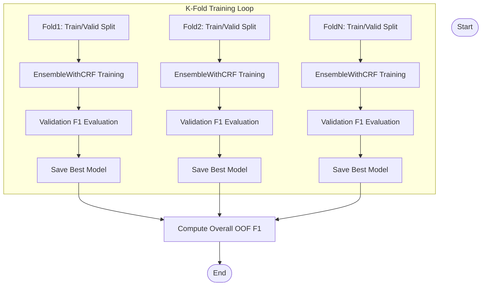
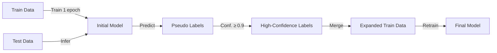
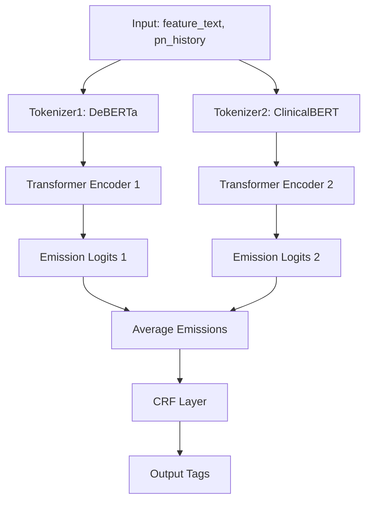

```mermaid
flowchart TD
    Start([Start])
    subgraph K-Fold Training Loop
        direction TB
        A1[Fold1: Train/Valid Split] --> B1[EnsembleWithCRF Training]
        B1 --> C1[Validation F1 Evaluation]
        C1 --> D1[Save Best Model]
        A2[Fold2: Train/Valid Split] --> B2[EnsembleWithCRF Training]
        B2 --> C2[Validation F1 Evaluation]
        C2 --> D2[Save Best Model]
        A3[FoldN: Train/Valid Split] --> B3[EnsembleWithCRF Training]
        B3 --> C3[Validation F1 Evaluation]
        C3 --> D3[Save Best Model]
    end
    D1 & D2 & D3 --> OverallF1[Compute Overall OOF F1]
    OverallF1 --> End([End])

```

```mermaid
flowchart LR
    A[Train Data] -->|Train 1 epoch| C[Initial Model]
    B[Test Data]  -->|Infer| C
    C -->|Predict| D[Pseudo Labels]
    D -->|Conf. ≥ 0.9| E[High‑Confidence Labels]
    E -->|Merge| F[Expanded Train Data]
    F -->|Retrain| G[Final Model]
```

```mermaid
graph TD

    A[Input: feature_text, pn_history] --> B1[Tokenizer1: DeBERTa]

    A --> B2[Tokenizer2: ClinicalBERT]

    B1 --> C1[Transformer Encoder 1]

    B2 --> C2[Transformer Encoder 2]

    C1 --> D1[Emission Logits 1]

    C2 --> D2[Emission Logits 2]

    D1 & D2 --> E[Average Emissions]

    E --> F[CRF Layer]

    F --> G[Output Tags]
```